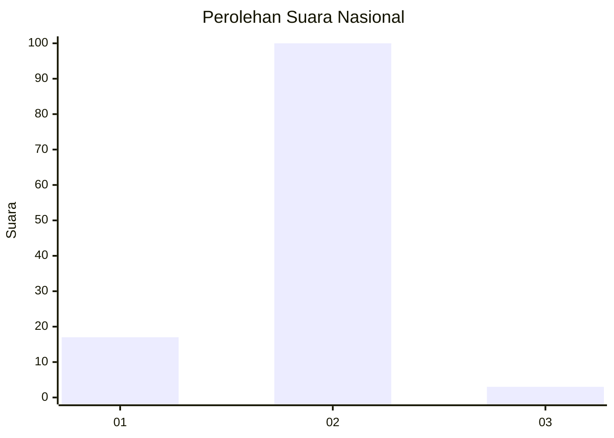
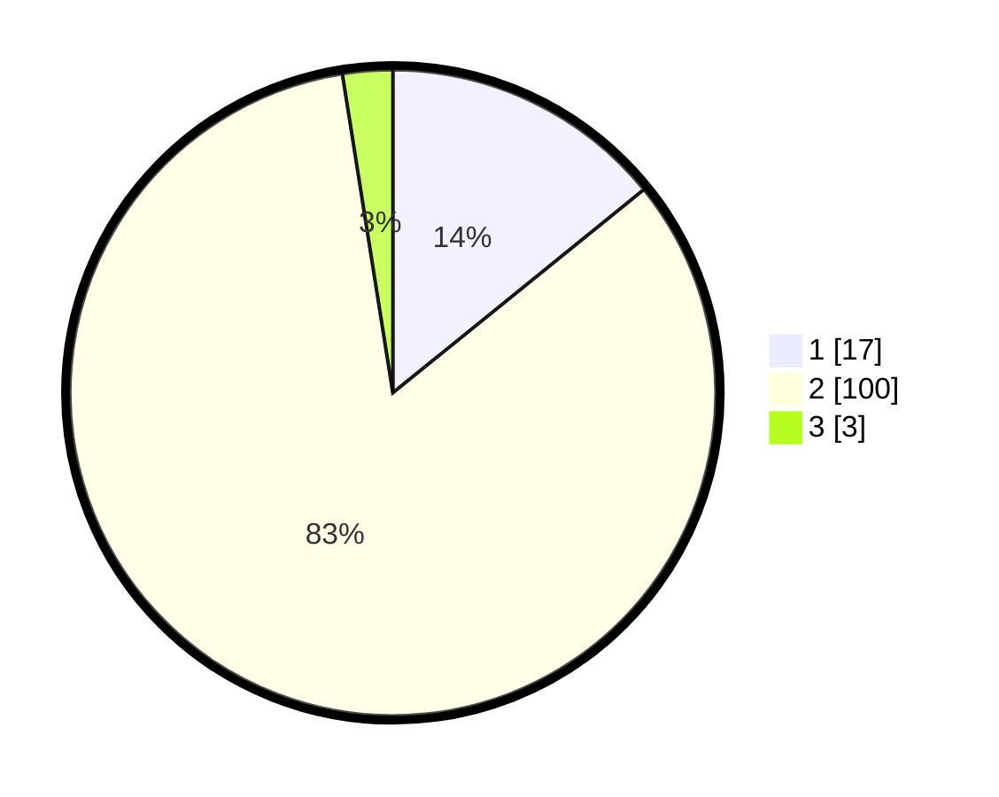

# Hasil

## Grafik

## Tabel

| No. | Nama Paslon    | Suara | Suara (raw) | Persentase |
|:--- |:-------------- | -----:| -----------:| ----------:|
| 1   | ANIES MUHAIMIN | 17    | [17][p-1]   | 14,17      |
| 2   | PRABOWO GIBRAN | 100   | [100][p-2]  | 83,33      |
| 3   | GANJAR MAHFUD  | 3     | [3][p-3]    | 2,50       |

[p-1]: https://github.com/gigit-pemilu/pemilu-2024/blob/main/pilpres/hitung-suara/sub/93-papua-selatan/sub/01-merauke/sub/01-merauke/sub/1002-samkai/sub/005-tps/sub/paslon-1.txt
[p-2]: https://github.com/gigit-pemilu/pemilu-2024/blob/main/pilpres/hitung-suara/sub/93-papua-selatan/sub/01-merauke/sub/01-merauke/sub/1002-samkai/sub/005-tps/sub/paslon-2.txt
[p-3]: https://github.com/gigit-pemilu/pemilu-2024/blob/main/pilpres/hitung-suara/sub/93-papua-selatan/sub/01-merauke/sub/01-merauke/sub/1002-samkai/sub/005-tps/sub/paslon-3.txt

## Foto C Plano

https://sirekap-obj-formc.kpu.go.id/a2f7/pemilu/ppwp/93/01/01/10/02/9301011002005-20240214-225615--2ebe3e31-a1ec-485e-92f7-1e4de9292d56.jpg

https://sirekap-obj-formc.kpu.go.id/a2f7/pemilu/ppwp/93/01/01/10/02/9301011002005-20240214-225832--50b59aca-c663-466c-a44b-ada9780edfda.jpg

https://sirekap-obj-formc.kpu.go.id/a2f7/pemilu/ppwp/93/01/01/10/02/9301011002005-20240214-225923--897daaed-ffd1-4c89-923f-1ef4e81f8c2e.jpg

## Metadata

| Key        | Value               |
| ---------- | ------------------- |
| Time Stamp | 2024-02-15 19:30:26 |

