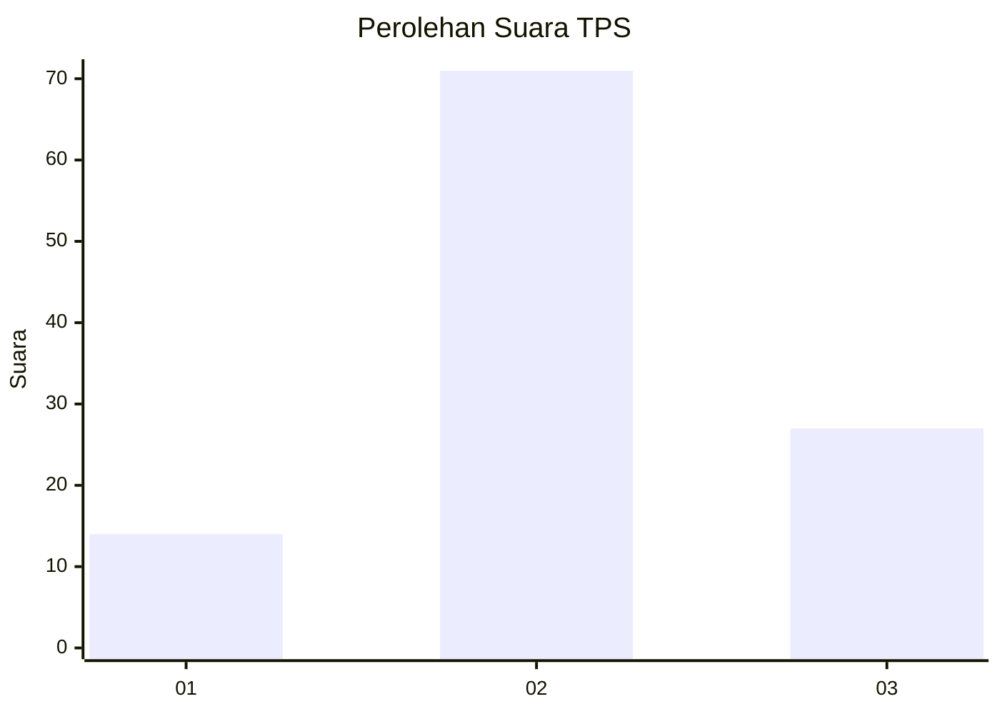
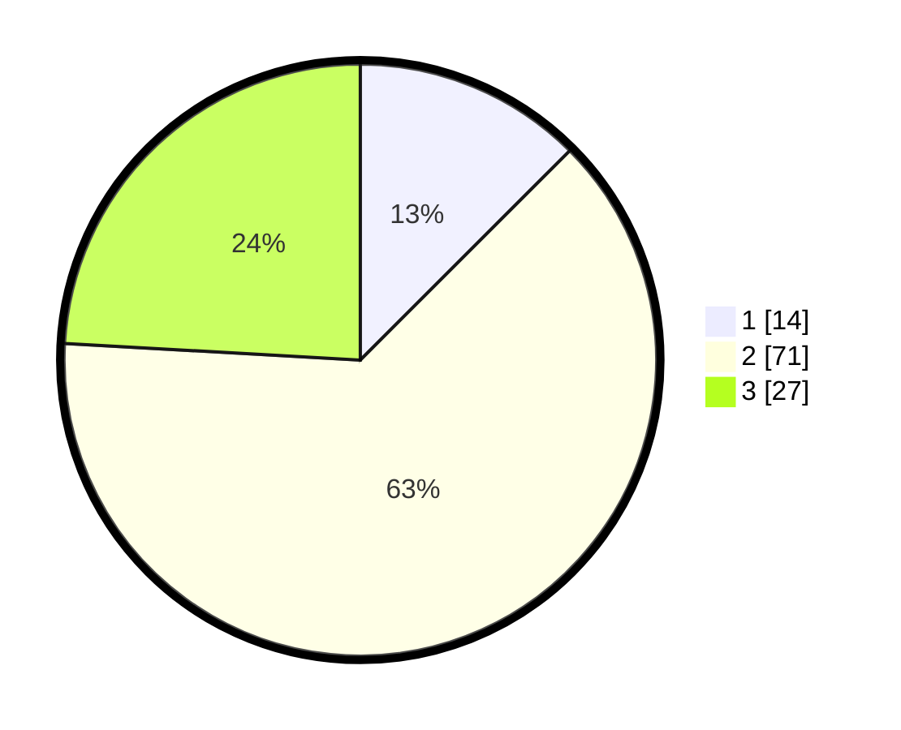

# Hasil

## Grafik

## Tabel

| No. | Nama Paslon    | Suara | Suara (raw) | Persentase |
|:--- |:-------------- | -----:| -----------:| ----------:|
| 1   | ANIES MUHAIMIN | 14    | [14][p-1]   | 12,50      |
| 2   | PRABOWO GIBRAN | 71    | [71][p-2]   | 63,39      |
| 3   | GANJAR MAHFUD  | 27    | [27][p-3]   | 24,11      |

[p-1]: https://github.com/gigit-pemilu/pemilu-2024-93-papua-selatan/blob/main/pilpres/hitung-suara/sub/93-papua-selatan/sub/01-merauke/sub/01-merauke/sub/1002-samkai/sub/013-tps/sub/paslon-1.txt
[p-2]: https://github.com/gigit-pemilu/pemilu-2024-93-papua-selatan/blob/main/pilpres/hitung-suara/sub/93-papua-selatan/sub/01-merauke/sub/01-merauke/sub/1002-samkai/sub/013-tps/sub/paslon-2.txt
[p-3]: https://github.com/gigit-pemilu/pemilu-2024-93-papua-selatan/blob/main/pilpres/hitung-suara/sub/93-papua-selatan/sub/01-merauke/sub/01-merauke/sub/1002-samkai/sub/013-tps/sub/paslon-3.txt

## Foto C Plano

https://sirekap-obj-formc.kpu.go.id/259e/pemilu/ppwp/93/01/01/10/02/9301011002013-20240214-132627--d6a77f88-dc0b-4140-81f6-48164b84af27.jpg

https://sirekap-obj-formc.kpu.go.id/259e/pemilu/ppwp/93/01/01/10/02/9301011002013-20240214-141934--b3c0f7f7-b83f-4838-bb8b-42bacedf524a.jpg

https://sirekap-obj-formc.kpu.go.id/259e/pemilu/ppwp/93/01/01/10/02/9301011002013-20240214-132851--c60e447e-7503-46ee-809f-a9f70a0bcea0.jpg

## Metadata

| Key        | Value               |
| ---------- | ------------------- |
| Time Stamp | 2024-02-15 19:30:26 |

## DATA PEMILIH TETAP

Jumlah pemilih dalam DPT: **183**.
 * L: **46**.
 * P: **60**.

## DATA PENGGUNA HAK PILIH

Jumlah pengguna hak pilih dalam DPT: **106**.
 * L: **46**.
 * P: **60**.

Jumlah pengguna hak pilih dalam DPTb: **0**.
 * L: **0**.
 * P: **0**.

Jumlah pengguna hak pilih dalam DPK: **6**.
 * L: **2**.
 * P: **4**.

Jumlah pengguna hak pilih: **0**.
 * L: **0**.
 * P: **0**.

## JUMLAH SUARA SAH DAN TIDAK SAH

JUMLAH SELURUH SUARA SAH: **112**.

JUMLAH SUARA TIDAK SAH: **0**.

JUMLAH SELURUH SUARA SAH DAN SUARA TIDAK SAH: **112**.

