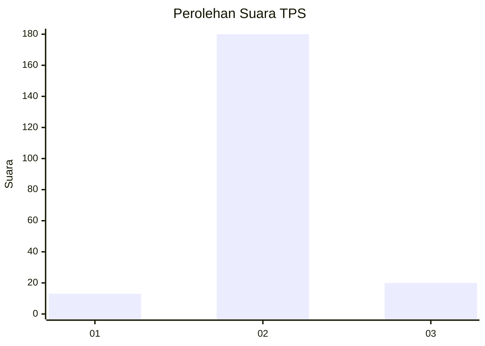
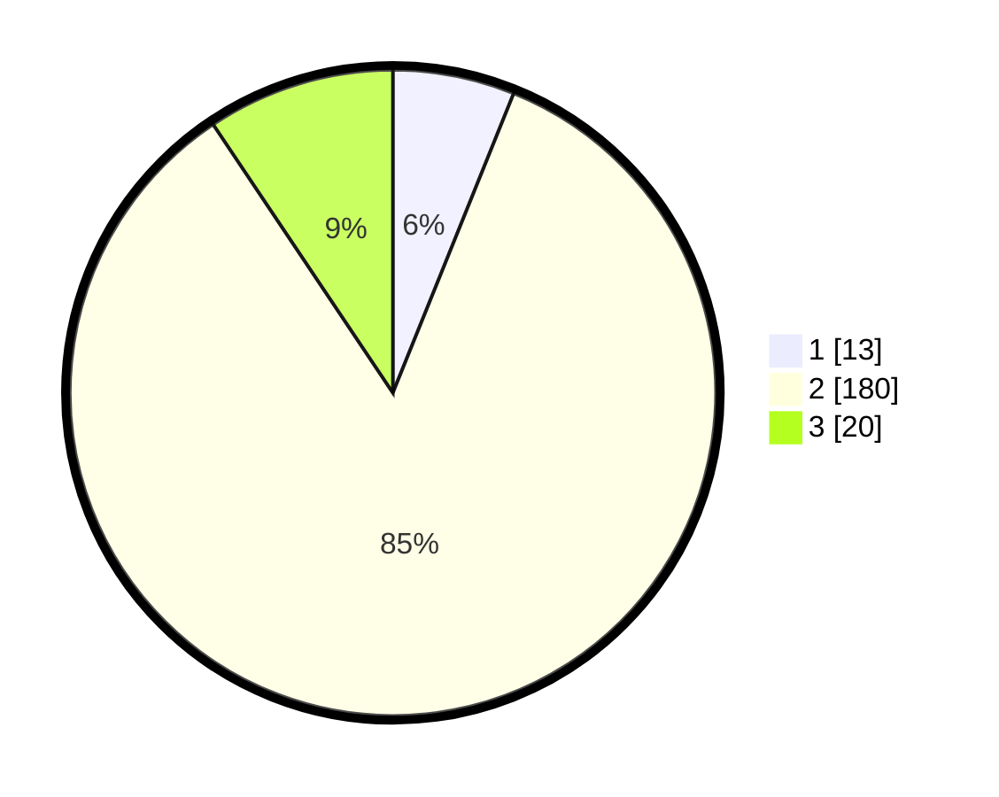

# Hasil

## Grafik

## Tabel

| No. | Nama Paslon    | Suara | Suara (raw) | Persentase |
|:--- |:-------------- | -----:| -----------:| ----------:|
| 1   | ANIES MUHAIMIN | 13    | [13][p-1]   | 6,10       |
| 2   | PRABOWO GIBRAN | 180   | [180][p-2]  | 84,51      |
| 3   | GANJAR MAHFUD  | 20    | [20][p-3]   | 9,39       |

[p-1]: https://github.com/gigit-pemilu/pemilu-2024-93-papua-selatan/blob/main/pilpres/hitung-suara/sub/93-papua-selatan/sub/01-merauke/sub/01-merauke/sub/1002-samkai/sub/016-tps/sub/paslon-1.txt
[p-2]: https://github.com/gigit-pemilu/pemilu-2024-93-papua-selatan/blob/main/pilpres/hitung-suara/sub/93-papua-selatan/sub/01-merauke/sub/01-merauke/sub/1002-samkai/sub/016-tps/sub/paslon-2.txt
[p-3]: https://github.com/gigit-pemilu/pemilu-2024-93-papua-selatan/blob/main/pilpres/hitung-suara/sub/93-papua-selatan/sub/01-merauke/sub/01-merauke/sub/1002-samkai/sub/016-tps/sub/paslon-3.txt

## Foto C Plano

https://sirekap-obj-formc.kpu.go.id/d68c/pemilu/ppwp/93/01/01/10/02/9301011002016-20240214-184954--11909003-dd0d-4ab8-b297-8ad97436bcbd.jpg

https://sirekap-obj-formc.kpu.go.id/d68c/pemilu/ppwp/93/01/01/10/02/9301011002016-20240214-185606--ba1ed7de-0199-40a6-a0b4-be52c2acfa9c.jpg

https://sirekap-obj-formc.kpu.go.id/d68c/pemilu/ppwp/93/01/01/10/02/9301011002016-20240214-185827--121016cd-0752-4d35-a97e-c972eb1d3706.jpg

## Metadata

| Key        | Value               |
| ---------- | ------------------- |
| Time Stamp | 2024-02-14 21:46:01 |

## DATA PEMILIH TETAP

Jumlah pemilih dalam DPT: **260**.
 * L: **144**.
 * P: **116**.

## DATA PENGGUNA HAK PILIH

Jumlah pengguna hak pilih dalam DPT: **184**.
 * L: **91**.
 * P: **93**.

Jumlah pengguna hak pilih dalam DPTb: **16**.
 * L: **13**.
 * P: **3**.

Jumlah pengguna hak pilih dalam DPK: **19**.
 * L: **13**.
 * P: **6**.

Jumlah pengguna hak pilih: **219**.
 * L: **117**.
 * P: **102**.

## JUMLAH SUARA SAH DAN TIDAK SAH

JUMLAH SELURUH SUARA SAH: **213**.

JUMLAH SUARA TIDAK SAH: **6**.

JUMLAH SELURUH SUARA SAH DAN SUARA TIDAK SAH: **219**.

