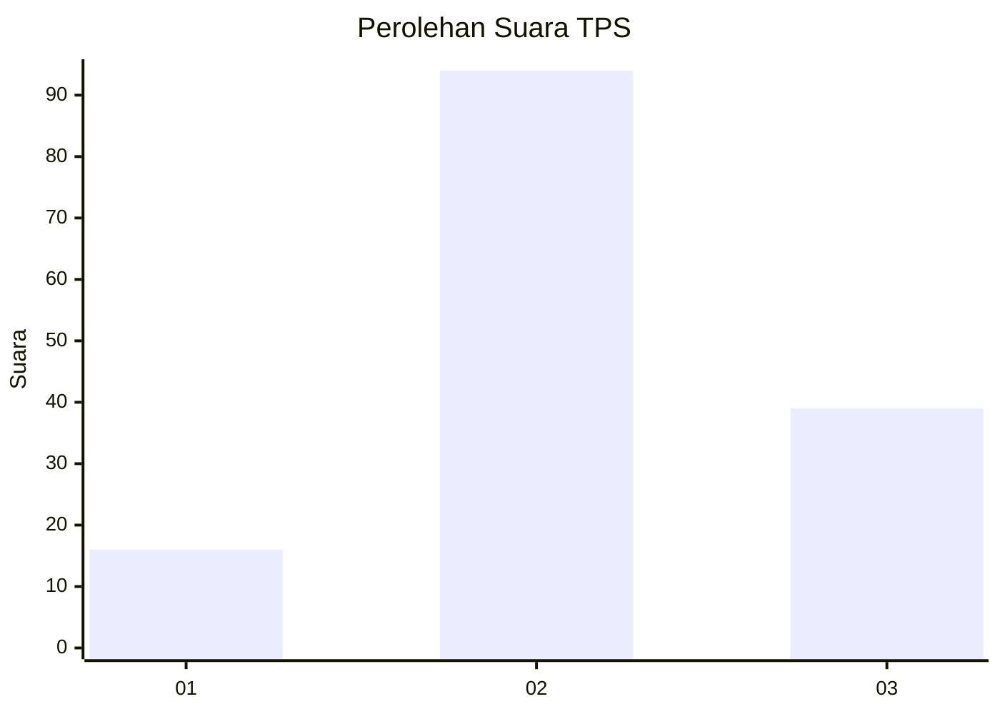
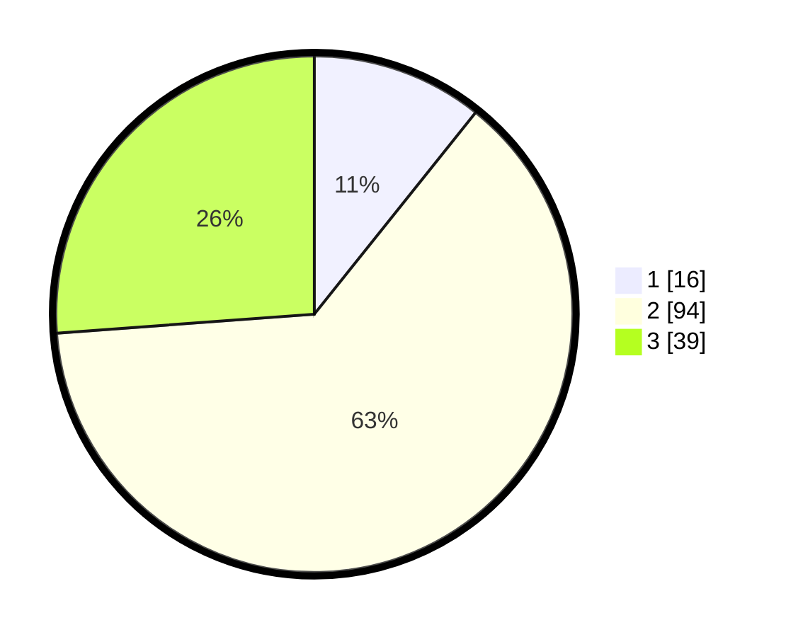

# Hasil

## Grafik

## Tabel

| No. | Nama Paslon    | Suara | Suara (raw) | Persentase |
|:--- |:-------------- | -----:| -----------:| ----------:|
| 1   | ANIES MUHAIMIN | 16    | [16][p-1]   | 10,74      |
| 2   | PRABOWO GIBRAN | 94    | [94][p-2]   | 63,09      |
| 3   | GANJAR MAHFUD  | 39    | [39][p-3]   | 26,17      |

[p-1]: https://github.com/gigit-pemilu/pemilu-2024-93-papua-selatan/blob/main/pilpres/hitung-suara/sub/93-papua-selatan/sub/01-merauke/sub/01-merauke/sub/1002-samkai/sub/018-tps/sub/paslon-1.txt
[p-2]: https://github.com/gigit-pemilu/pemilu-2024-93-papua-selatan/blob/main/pilpres/hitung-suara/sub/93-papua-selatan/sub/01-merauke/sub/01-merauke/sub/1002-samkai/sub/018-tps/sub/paslon-2.txt
[p-3]: https://github.com/gigit-pemilu/pemilu-2024-93-papua-selatan/blob/main/pilpres/hitung-suara/sub/93-papua-selatan/sub/01-merauke/sub/01-merauke/sub/1002-samkai/sub/018-tps/sub/paslon-3.txt

## Foto C Plano

https://sirekap-obj-formc.kpu.go.id/874d/pemilu/ppwp/93/01/01/10/02/9301011002018-20240214-132754--788f5ddf-a32a-4f04-9194-d9a18aad488d.jpg

https://sirekap-obj-formc.kpu.go.id/874d/pemilu/ppwp/93/01/01/10/02/9301011002018-20240216-004648--db57dace-66a5-406b-8f89-d3177af72f99.jpg

https://sirekap-obj-formc.kpu.go.id/874d/pemilu/ppwp/93/01/01/10/02/9301011002018-20240216-004647--b94678f1-3bcc-4ab0-bde1-bf79fe153ec4.jpg

## Metadata

| Key        | Value               |
| ---------- | ------------------- |
| Time Stamp | 2024-02-24 22:31:28 |

## DATA PEMILIH TETAP

Jumlah pemilih dalam DPT: **215**.
 * L: **109**.
 * P: **106**.

## DATA PENGGUNA HAK PILIH

Jumlah pengguna hak pilih dalam DPT: **143**.
 * L: **73**.
 * P: **70**.

Jumlah pengguna hak pilih dalam DPTb: **2**.
 * L: **2**.
 * P: **0**.

Jumlah pengguna hak pilih dalam DPK: **4**.
 * L: **2**.
 * P: **2**.

Jumlah pengguna hak pilih: **149**.
 * L: **77**.
 * P: **72**.

## JUMLAH SUARA SAH DAN TIDAK SAH

JUMLAH SELURUH SUARA SAH: **149**.

JUMLAH SUARA TIDAK SAH: **0**.

JUMLAH SELURUH SUARA SAH DAN SUARA TIDAK SAH: **149**.

