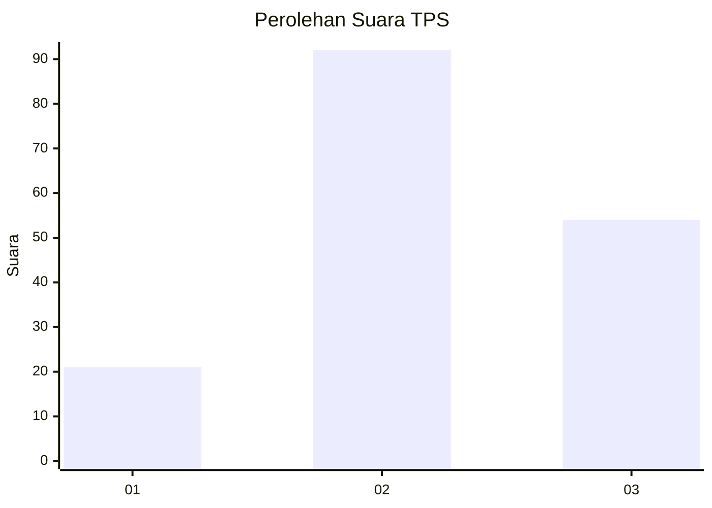
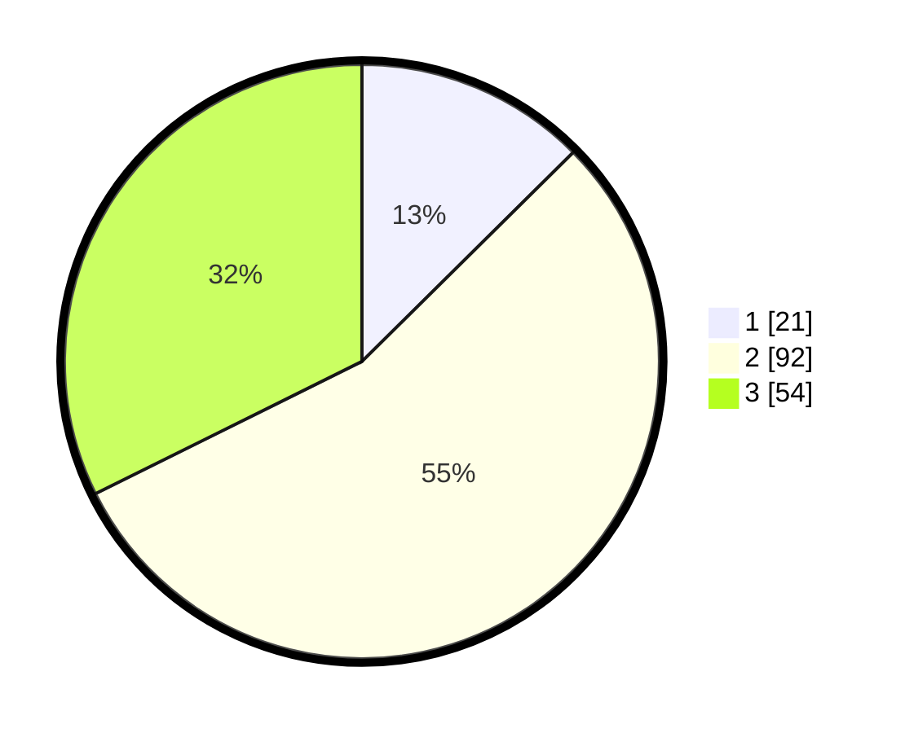

# Hasil

## Grafik

## Tabel

| No. | Nama Paslon    | Suara | Suara (raw) | Persentase |
|:--- |:-------------- | -----:| -----------:| ----------:|
| 1   | ANIES MUHAIMIN | 21    | [21][p-1]   | 12,57      |
| 2   | PRABOWO GIBRAN | 92    | [92][p-2]   | 55,09      |
| 3   | GANJAR MAHFUD  | 54    | [54][p-3]   | 32,34      |

[p-1]: https://github.com/gigit-pemilu/pemilu-2024-93-papua-selatan/blob/main/pilpres/hitung-suara/sub/93-papua-selatan/sub/01-merauke/sub/01-merauke/sub/1002-samkai/sub/021-tps/sub/paslon-1.txt
[p-2]: https://github.com/gigit-pemilu/pemilu-2024-93-papua-selatan/blob/main/pilpres/hitung-suara/sub/93-papua-selatan/sub/01-merauke/sub/01-merauke/sub/1002-samkai/sub/021-tps/sub/paslon-2.txt
[p-3]: https://github.com/gigit-pemilu/pemilu-2024-93-papua-selatan/blob/main/pilpres/hitung-suara/sub/93-papua-selatan/sub/01-merauke/sub/01-merauke/sub/1002-samkai/sub/021-tps/sub/paslon-3.txt

## Foto C Plano

https://sirekap-obj-formc.kpu.go.id/0d30/pemilu/ppwp/93/01/01/10/02/9301011002021-20240215-022309--95cfa1b4-130b-42d9-95c0-68a01d97809e.jpg

https://sirekap-obj-formc.kpu.go.id/0d30/pemilu/ppwp/93/01/01/10/02/9301011002021-20240215-025901--17690bd4-1ab3-48ee-b688-aae51a14097c.jpg

https://sirekap-obj-formc.kpu.go.id/0d30/pemilu/ppwp/93/01/01/10/02/9301011002021-20240215-023319--46cc89ef-3ddd-4061-8dff-7c69d71f5b0b.jpg

## Metadata

| Key        | Value               |
| ---------- | ------------------- |
| Time Stamp | 2024-02-15 19:30:26 |

