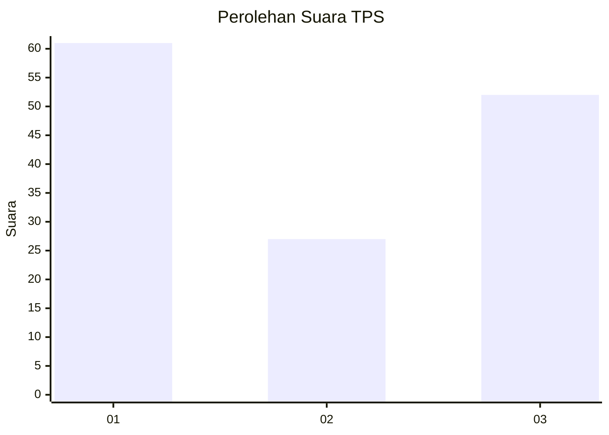
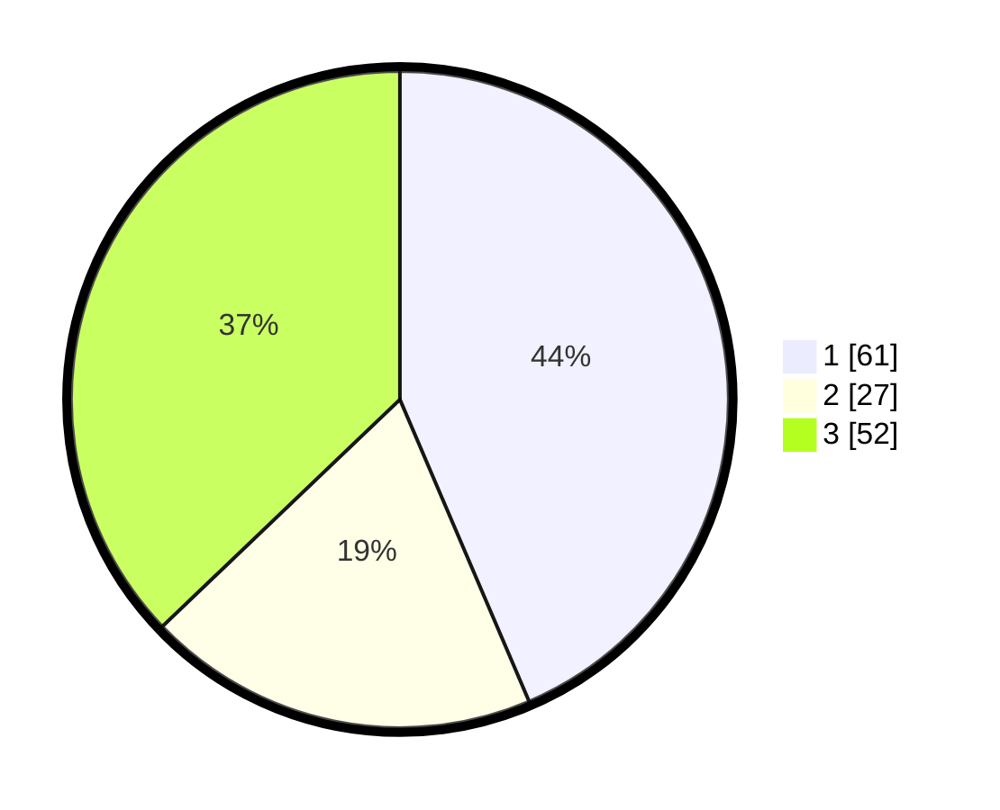

# Hasil

## Grafik

## Tabel

| No. | Nama Paslon    | Suara | Suara (raw) | Persentase |
|:--- |:-------------- | -----:| -----------:| ----------:|
| 1   | ANIES MUHAIMIN | 61    | [61][p-1]   | 43,57      |
| 2   | PRABOWO GIBRAN | 27    | [27][p-2]   | 19,29      |
| 3   | GANJAR MAHFUD  | 52    | [52][p-3]   | 37,14      |

[p-1]: https://github.com/gigit-pemilu/pemilu-2024-93-papua-selatan/blob/main/pilpres/hitung-suara/sub/93-papua-selatan/sub/01-merauke/sub/02-muting/sub/2004-kolam/sub/001-tps/sub/paslon-1.txt
[p-2]: https://github.com/gigit-pemilu/pemilu-2024-93-papua-selatan/blob/main/pilpres/hitung-suara/sub/93-papua-selatan/sub/01-merauke/sub/02-muting/sub/2004-kolam/sub/001-tps/sub/paslon-2.txt
[p-3]: https://github.com/gigit-pemilu/pemilu-2024-93-papua-selatan/blob/main/pilpres/hitung-suara/sub/93-papua-selatan/sub/01-merauke/sub/02-muting/sub/2004-kolam/sub/001-tps/sub/paslon-3.txt

## Foto C Plano

https://sirekap-obj-formc.kpu.go.id/5bb9/pemilu/ppwp/93/01/02/20/04/9301022004001-20240217-180239--c243f385-e027-4faa-9aa5-e53fdefc8620.jpg

https://sirekap-obj-formc.kpu.go.id/5bb9/pemilu/ppwp/93/01/02/20/04/9301022004001-20240217-180354--44996770-37cd-4b3b-8bb2-30d0ef0de5b2.jpg

https://sirekap-obj-formc.kpu.go.id/5bb9/pemilu/ppwp/93/01/02/20/04/9301022004001-20240217-180501--100f4fab-7740-4aca-aab9-2387e9ef5d54.jpg

## Metadata

| Key        | Value               |
| ---------- | ------------------- |
| Time Stamp | 2024-02-25 13:00:00 |

