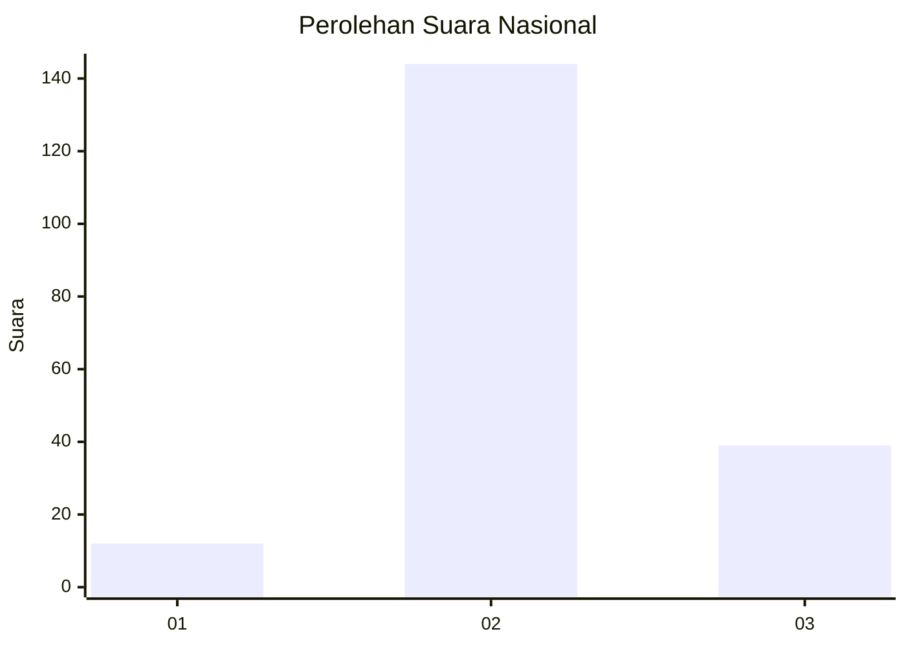

# Hasil

## Grafik

## Tabel

| No. | Nama Paslon    | Suara | Suara (raw) | Persentase |
|:--- |:-------------- | -----:| -----------:| ----------:|
| 1   | ANIES MUHAIMIN | 12    | [12][p-1]   | 6,15       |
| 2   | PRABOWO GIBRAN | 144   | [144][p-2]  | 73,85      |
| 3   | GANJAR MAHFUD  | 39    | [39][p-3]   | 20,00      |

[p-1]: https://github.com/gigit-pemilu/pemilu-2024/blob/main/pilpres/hitung-suara/sub/93-papua-selatan/sub/01-merauke/sub/05-semangga/sub/2001-matara/sub/002-tps/sub/paslon-1.txt
[p-2]: https://github.com/gigit-pemilu/pemilu-2024/blob/main/pilpres/hitung-suara/sub/93-papua-selatan/sub/01-merauke/sub/05-semangga/sub/2001-matara/sub/002-tps/sub/paslon-2.txt
[p-3]: https://github.com/gigit-pemilu/pemilu-2024/blob/main/pilpres/hitung-suara/sub/93-papua-selatan/sub/01-merauke/sub/05-semangga/sub/2001-matara/sub/002-tps/sub/paslon-3.txt

## Foto C Plano

https://sirekap-obj-formc.kpu.go.id/4556/pemilu/ppwp/93/01/05/20/01/9301052001002-20240219-080555--2e453ad1-cbba-4cfe-953e-cabcf5334f9d.jpg

https://sirekap-obj-formc.kpu.go.id/4556/pemilu/ppwp/93/01/05/20/01/9301052001002-20240219-080650--6f812f8f-6ddc-415d-93eb-97e16e301577.jpg

https://sirekap-obj-formc.kpu.go.id/4556/pemilu/ppwp/93/01/05/20/01/9301052001002-20240219-080743--2ddfa789-f8a3-4786-b896-a42091d7e56c.jpg

## Metadata

| Key        | Value               |
| ---------- | ------------------- |
| Time Stamp | 2024-02-25 00:00:00 |

