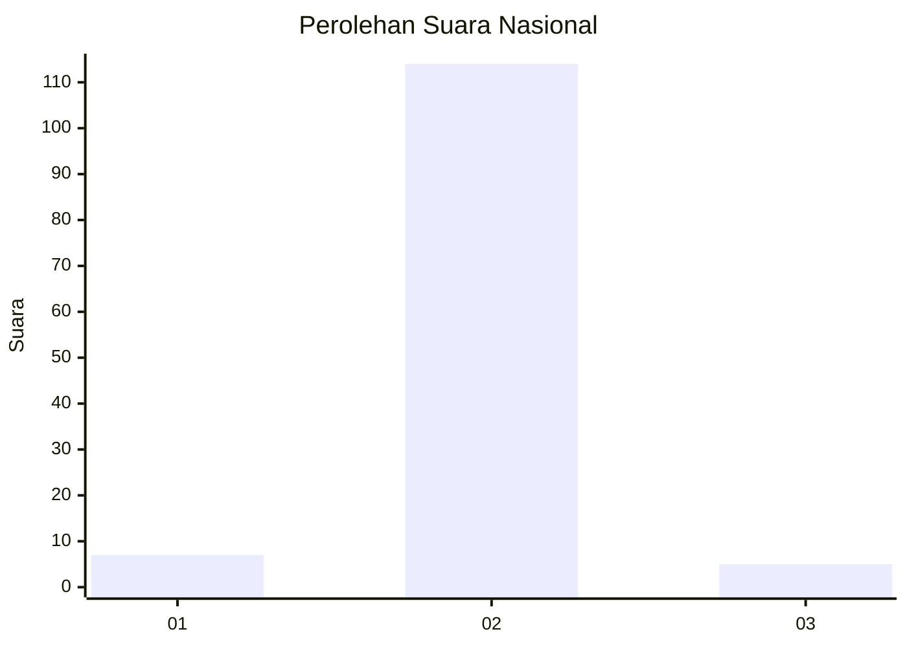
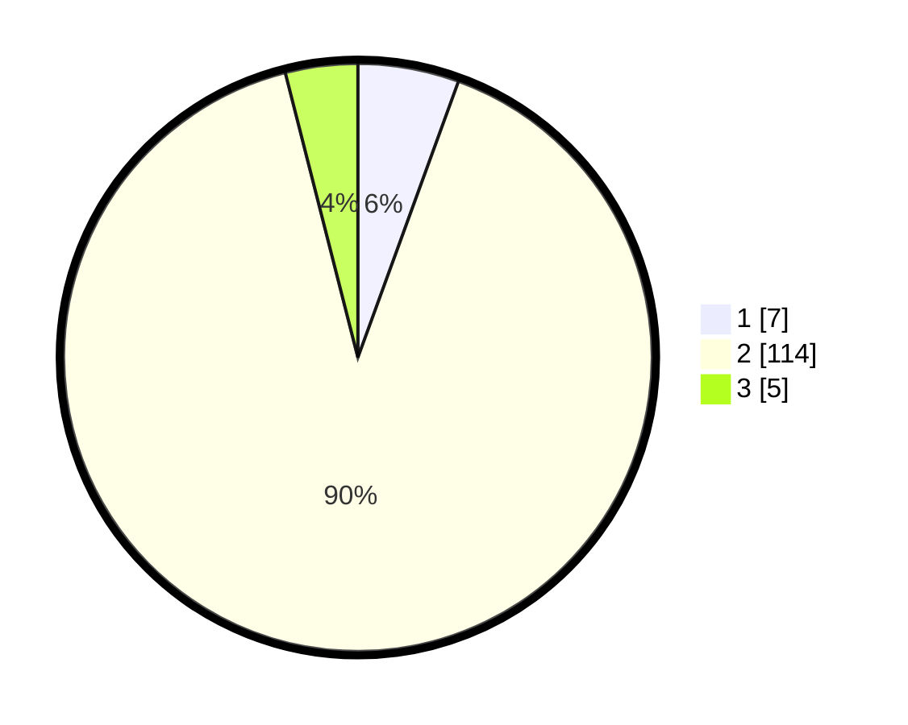

# Hasil

## Grafik

## Tabel

| No. | Nama Paslon    | Suara | Suara (raw) | Persentase |
|:--- |:-------------- | -----:| -----------:| ----------:|
| 1   | ANIES MUHAIMIN | 7     | [7][p-1]    | 5,56       |
| 2   | PRABOWO GIBRAN | 114   | [114][p-2]  | 90,48      |
| 3   | GANJAR MAHFUD  | 5     | [5][p-3]    | 3,97       |

[p-1]: https://github.com/gigit-pemilu/pemilu-2024/blob/main/pilpres/hitung-suara/sub/93-papua-selatan/sub/01-merauke/sub/05-semangga/sub/2010-waninggap-kai/sub/005-tps/sub/paslon-1.txt
[p-2]: https://github.com/gigit-pemilu/pemilu-2024/blob/main/pilpres/hitung-suara/sub/93-papua-selatan/sub/01-merauke/sub/05-semangga/sub/2010-waninggap-kai/sub/005-tps/sub/paslon-2.txt
[p-3]: https://github.com/gigit-pemilu/pemilu-2024/blob/main/pilpres/hitung-suara/sub/93-papua-selatan/sub/01-merauke/sub/05-semangga/sub/2010-waninggap-kai/sub/005-tps/sub/paslon-3.txt

## Foto C Plano

https://sirekap-obj-formc.kpu.go.id/b28e/pemilu/ppwp/93/01/05/20/10/9301052010005-20240214-131954--aa28ca76-3895-40ee-b2d1-2653e447113d.jpg

https://sirekap-obj-formc.kpu.go.id/b28e/pemilu/ppwp/93/01/05/20/10/9301052010005-20240214-132520--a427e7a9-4aaa-4f5c-a73e-8ad6102b98ad.jpg

https://sirekap-obj-formc.kpu.go.id/b28e/pemilu/ppwp/93/01/05/20/10/9301052010005-20240214-133019--336a8e64-0870-4dd2-8b9d-666cca2d557d.jpg

## Metadata

| Key        | Value               |
| ---------- | ------------------- |
| Time Stamp | 2024-02-25 13:00:00 |

