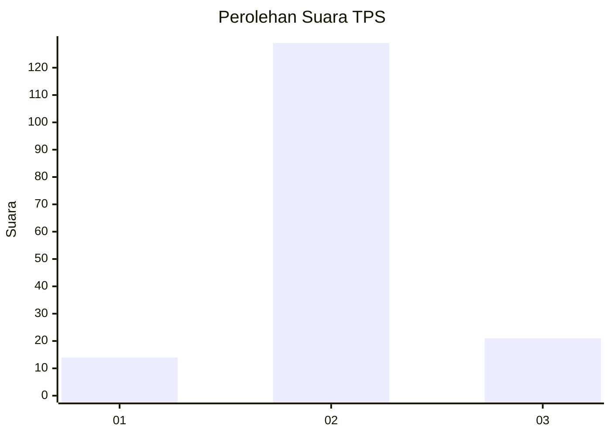
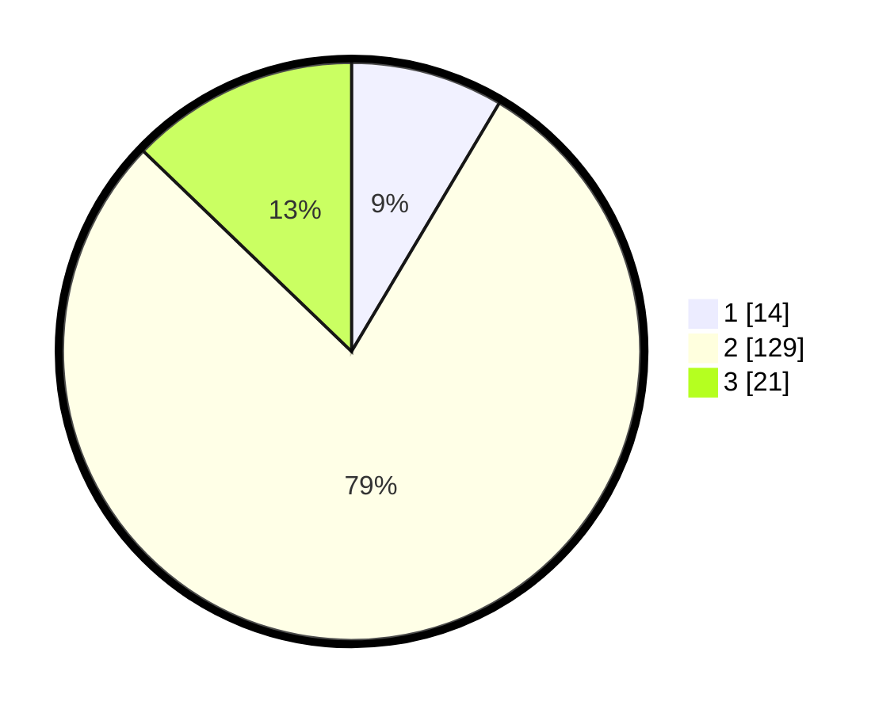

# Hasil

## Grafik

## Tabel

| No. | Nama Paslon    | Suara | Suara (raw) | Persentase |
|:--- |:-------------- | -----:| -----------:| ----------:|
| 1   | ANIES MUHAIMIN | 14    | [14][p-1]   | 8,54       |
| 2   | PRABOWO GIBRAN | 129   | [129][p-2]  | 78,66      |
| 3   | GANJAR MAHFUD  | 21    | [21][p-3]   | 12,80      |

[p-1]: https://github.com/gigit-pemilu/pemilu-2024-93-papua-selatan/blob/main/pilpres/hitung-suara/sub/93-papua-selatan/sub/01-merauke/sub/06-tanah-miring/sub/2001-yasa-mulya/sub/006-tps/sub/paslon-1.txt
[p-2]: https://github.com/gigit-pemilu/pemilu-2024-93-papua-selatan/blob/main/pilpres/hitung-suara/sub/93-papua-selatan/sub/01-merauke/sub/06-tanah-miring/sub/2001-yasa-mulya/sub/006-tps/sub/paslon-2.txt
[p-3]: https://github.com/gigit-pemilu/pemilu-2024-93-papua-selatan/blob/main/pilpres/hitung-suara/sub/93-papua-selatan/sub/01-merauke/sub/06-tanah-miring/sub/2001-yasa-mulya/sub/006-tps/sub/paslon-3.txt

## Foto C Plano

https://sirekap-obj-formc.kpu.go.id/a73b/pemilu/ppwp/93/01/06/20/01/9301062001006-20240215-125751--98001d42-f05f-42b3-bf0a-1ed4f50ce74b.jpg

https://sirekap-obj-formc.kpu.go.id/a73b/pemilu/ppwp/93/01/06/20/01/9301062001006-20240215-104830--42279c8b-10b1-49dd-9e48-025fbadbaf80.jpg

https://sirekap-obj-formc.kpu.go.id/a73b/pemilu/ppwp/93/01/06/20/01/9301062001006-20240215-104850--3bedf6c2-1138-4319-811c-6bfa5173b28d.jpg

## Metadata

| Key        | Value               |
| ---------- | ------------------- |
| Time Stamp | 2024-02-25 20:00:00 |

