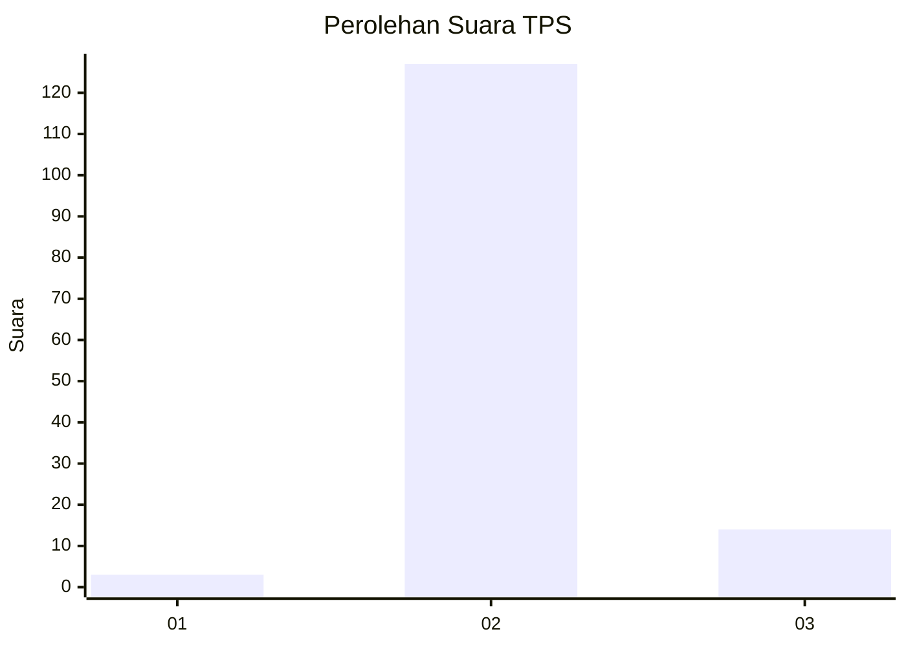
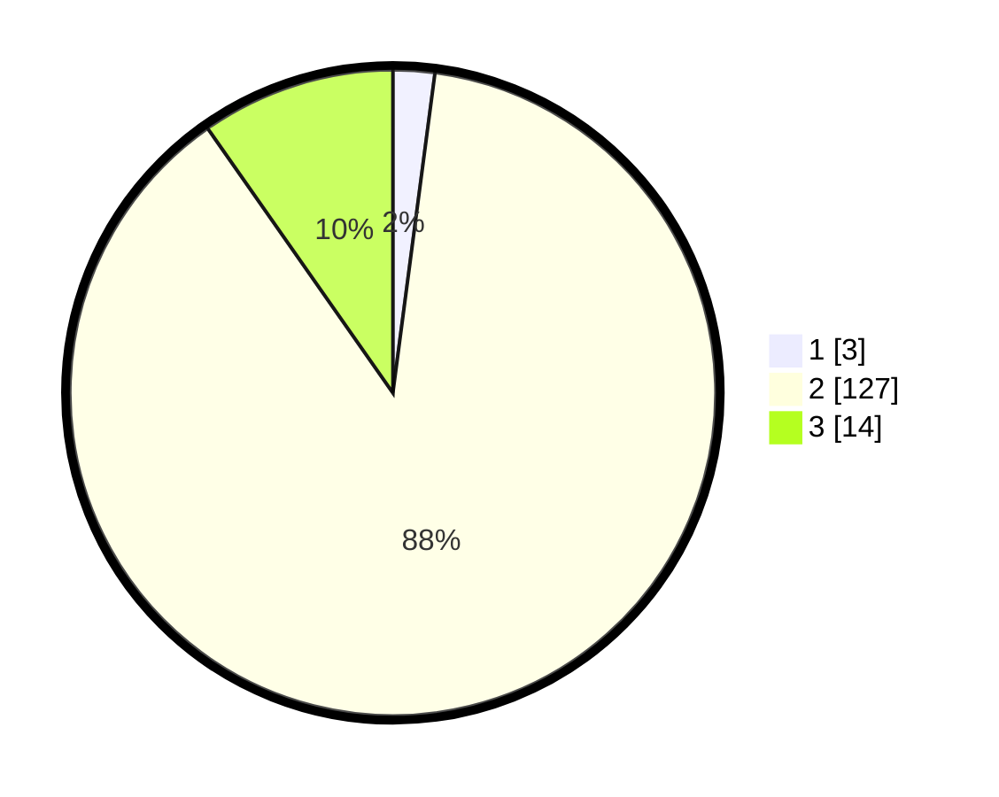

# Hasil

## Grafik

## Tabel

| No. | Nama Paslon    | Suara | Suara (raw) | Persentase |
|:--- |:-------------- | -----:| -----------:| ----------:|
| 1   | ANIES MUHAIMIN | 3     | [3][p-1]    | 2,08       |
| 2   | PRABOWO GIBRAN | 127   | [127][p-2]  | 88,19      |
| 3   | GANJAR MAHFUD  | 14    | [14][p-3]   | 9,72       |

[p-1]: https://github.com/gigit-pemilu/pemilu-2024-93-papua-selatan/blob/main/pilpres/hitung-suara/sub/93-papua-selatan/sub/01-merauke/sub/07-jagebob/sub/2001-kartini/sub/002-tps/sub/paslon-1.txt
[p-2]: https://github.com/gigit-pemilu/pemilu-2024-93-papua-selatan/blob/main/pilpres/hitung-suara/sub/93-papua-selatan/sub/01-merauke/sub/07-jagebob/sub/2001-kartini/sub/002-tps/sub/paslon-2.txt
[p-3]: https://github.com/gigit-pemilu/pemilu-2024-93-papua-selatan/blob/main/pilpres/hitung-suara/sub/93-papua-selatan/sub/01-merauke/sub/07-jagebob/sub/2001-kartini/sub/002-tps/sub/paslon-3.txt

## Foto C Plano

https://sirekap-obj-formc.kpu.go.id/2067/pemilu/ppwp/93/01/07/20/01/9301072001002-20240216-121727--d4d70e4e-c7fb-487d-8d54-5d5bdcc466b9.jpg

https://sirekap-obj-formc.kpu.go.id/2067/pemilu/ppwp/93/01/07/20/01/9301072001002-20240214-213138--74084d37-2c29-415f-b78c-b7992caf845e.jpg

https://sirekap-obj-formc.kpu.go.id/2067/pemilu/ppwp/93/01/07/20/01/9301072001002-20240214-213155--379465b7-fd0c-4700-987b-fbfa0e42f774.jpg

## Metadata

| Key        | Value               |
| ---------- | ------------------- |
| Time Stamp | 2024-02-16 12:51:22 |

