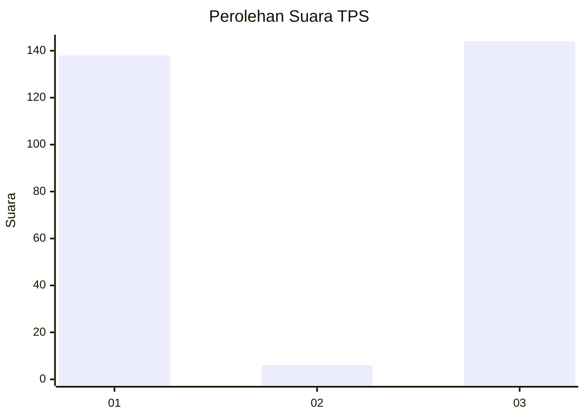
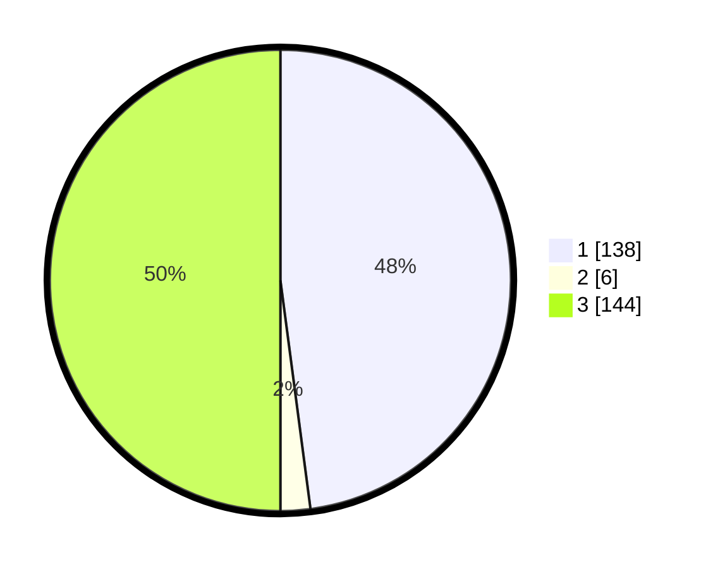

# Hasil

## Grafik

## Tabel

| No. | Nama Paslon    | Suara | Suara (raw) | Persentase |
|:--- |:-------------- | -----:| -----------:| ----------:|
| 1   | ANIES MUHAIMIN | 138   | [138][p-1]  | 47,92      |
| 2   | PRABOWO GIBRAN | 6     | [6][p-2]    | 2,08       |
| 3   | GANJAR MAHFUD  | 144   | [144][p-3]  | 50,00      |

[p-1]: https://github.com/gigit-pemilu/pemilu-2024-93-papua-selatan/blob/main/pilpres/hitung-suara/sub/93-papua-selatan/sub/01-merauke/sub/07-jagebob/sub/2004-angger-permegi/sub/005-tps/sub/paslon-1.txt
[p-2]: https://github.com/gigit-pemilu/pemilu-2024-93-papua-selatan/blob/main/pilpres/hitung-suara/sub/93-papua-selatan/sub/01-merauke/sub/07-jagebob/sub/2004-angger-permegi/sub/005-tps/sub/paslon-2.txt
[p-3]: https://github.com/gigit-pemilu/pemilu-2024-93-papua-selatan/blob/main/pilpres/hitung-suara/sub/93-papua-selatan/sub/01-merauke/sub/07-jagebob/sub/2004-angger-permegi/sub/005-tps/sub/paslon-3.txt

## Foto C Plano

https://sirekap-obj-formc.kpu.go.id/98c1/pemilu/ppwp/93/01/07/20/04/9301072004005-20240214-132559--d617ad82-257b-4d86-8c29-042651fe5f78.jpg

https://sirekap-obj-formc.kpu.go.id/98c1/pemilu/ppwp/93/01/07/20/04/9301072004005-20240214-132739--924a8620-9a57-4a91-8e95-939005fac7f7.jpg

## Metadata

| Key        | Value               |
| ---------- | ------------------- |
| Time Stamp | 2024-02-25 15:00:00 |

