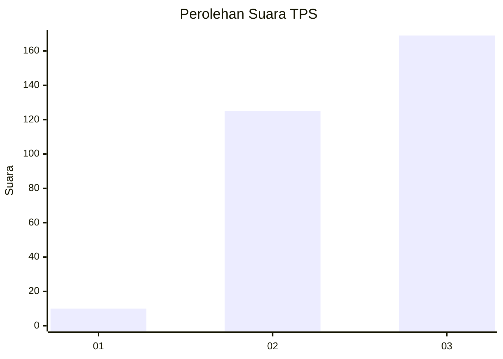
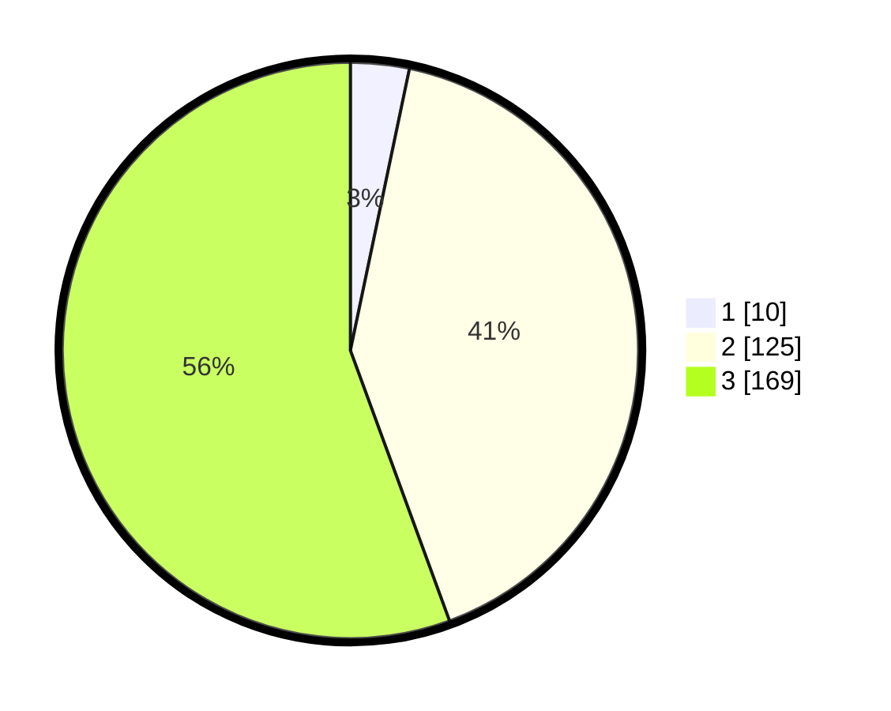

# Hasil

## Grafik

## Tabel

| No. | Nama Paslon    | Suara | Suara (raw) | Persentase |
|:--- |:-------------- | -----:| -----------:| ----------:|
| 1   | ANIES MUHAIMIN | 10    | [10][p-1]   | 3,29       |
| 2   | PRABOWO GIBRAN | 125   | [125][p-2]  | 41,12      |
| 3   | GANJAR MAHFUD  | 169   | [169][p-3]  | 55,59      |

[p-1]: https://github.com/gigit-pemilu/pemilu-2024-93-papua-selatan/blob/main/pilpres/hitung-suara/sub/93-papua-selatan/sub/01-merauke/sub/07-jagebob/sub/2009-gurinda-jaya/sub/002-tps/sub/paslon-1.txt
[p-2]: https://github.com/gigit-pemilu/pemilu-2024-93-papua-selatan/blob/main/pilpres/hitung-suara/sub/93-papua-selatan/sub/01-merauke/sub/07-jagebob/sub/2009-gurinda-jaya/sub/002-tps/sub/paslon-2.txt
[p-3]: https://github.com/gigit-pemilu/pemilu-2024-93-papua-selatan/blob/main/pilpres/hitung-suara/sub/93-papua-selatan/sub/01-merauke/sub/07-jagebob/sub/2009-gurinda-jaya/sub/002-tps/sub/paslon-3.txt

## Foto C Plano

https://sirekap-obj-formc.kpu.go.id/5130/pemilu/ppwp/93/01/07/20/09/9301072009002-20240214-121351--beaf5b64-fd78-4c62-878f-a45a20f15566.jpg

https://sirekap-obj-formc.kpu.go.id/5130/pemilu/ppwp/93/01/07/20/09/9301072009002-20240214-121759--cc44f785-81f1-4e46-a83d-d41dbed1f2de.jpg

https://sirekap-obj-formc.kpu.go.id/5130/pemilu/ppwp/93/01/07/20/09/9301072009002-20240214-121719--8dd0547a-1aa7-4ba7-8927-0e666bedbebf.jpg

## Metadata

| Key        | Value               |
| ---------- | ------------------- |
| Time Stamp | 2024-02-15 20:30:46 |

