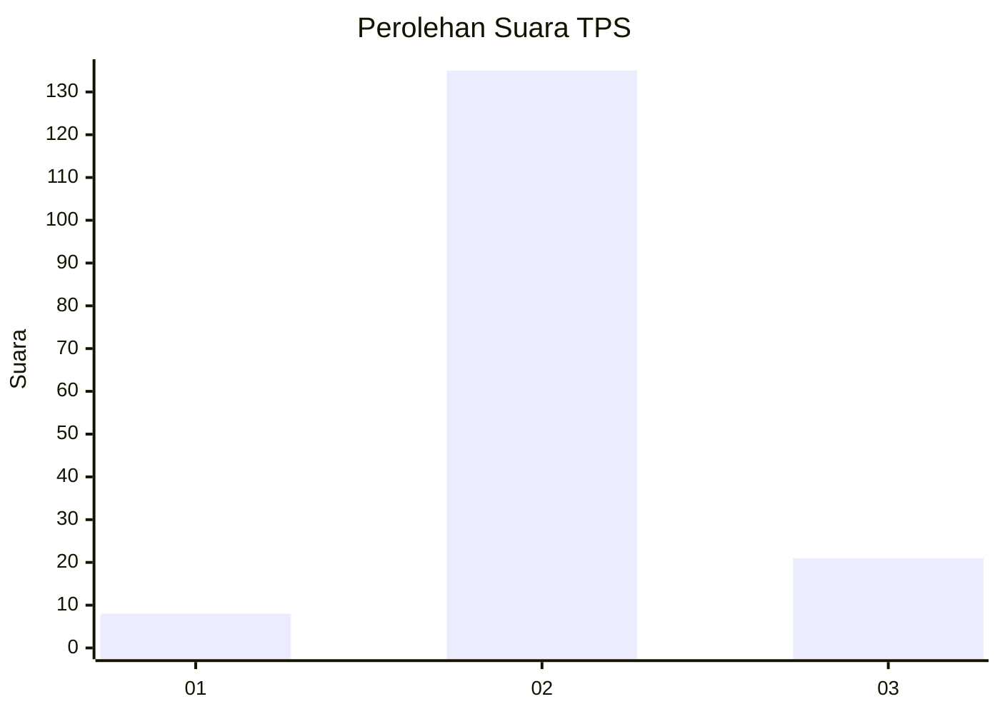
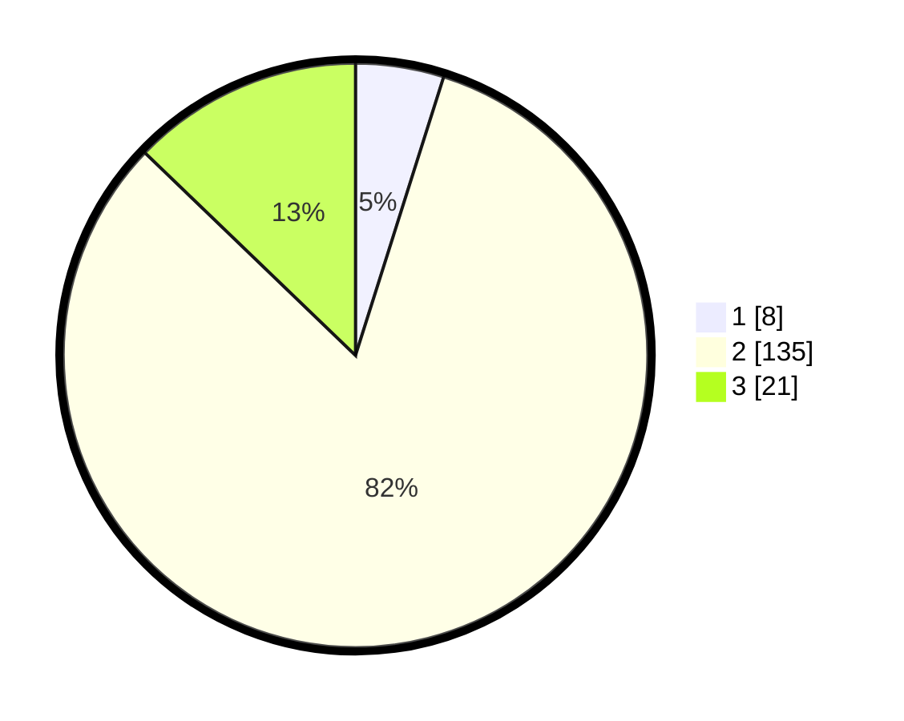

# Hasil

## Grafik

## Tabel

| No. | Nama Paslon    | Suara | Suara (raw) | Persentase |
|:--- |:-------------- | -----:| -----------:| ----------:|
| 1   | ANIES MUHAIMIN | 8     | [8][p-1]    | 4,88       |
| 2   | PRABOWO GIBRAN | 135   | [135][p-2]  | 82,32      |
| 3   | GANJAR MAHFUD  | 21    | [21][p-3]   | 12,80      |

[p-1]: https://github.com/gigit-pemilu/pemilu-2024-93-papua-selatan/blob/main/pilpres/hitung-suara/sub/93-papua-selatan/sub/01-merauke/sub/08-sota/sub/2002-yanggandur/sub/001-tps/sub/paslon-1.txt
[p-2]: https://github.com/gigit-pemilu/pemilu-2024-93-papua-selatan/blob/main/pilpres/hitung-suara/sub/93-papua-selatan/sub/01-merauke/sub/08-sota/sub/2002-yanggandur/sub/001-tps/sub/paslon-2.txt
[p-3]: https://github.com/gigit-pemilu/pemilu-2024-93-papua-selatan/blob/main/pilpres/hitung-suara/sub/93-papua-selatan/sub/01-merauke/sub/08-sota/sub/2002-yanggandur/sub/001-tps/sub/paslon-3.txt

## Foto C Plano

https://sirekap-obj-formc.kpu.go.id/a2b6/pemilu/ppwp/93/01/08/20/02/9301082002001-20240215-174315--0474d078-18bd-4ea0-81eb-c9a75142116c.jpg

https://sirekap-obj-formc.kpu.go.id/a2b6/pemilu/ppwp/93/01/08/20/02/9301082002001-20240215-122321--c6469c05-9d99-4f46-9310-199a48032a61.jpg

https://sirekap-obj-formc.kpu.go.id/a2b6/pemilu/ppwp/93/01/08/20/02/9301082002001-20240215-122640--47e7eada-e4bf-46af-8c03-66f676af6d0c.jpg

## Metadata

| Key        | Value               |
| ---------- | ------------------- |
| Time Stamp | 2024-02-25 14:00:00 |

