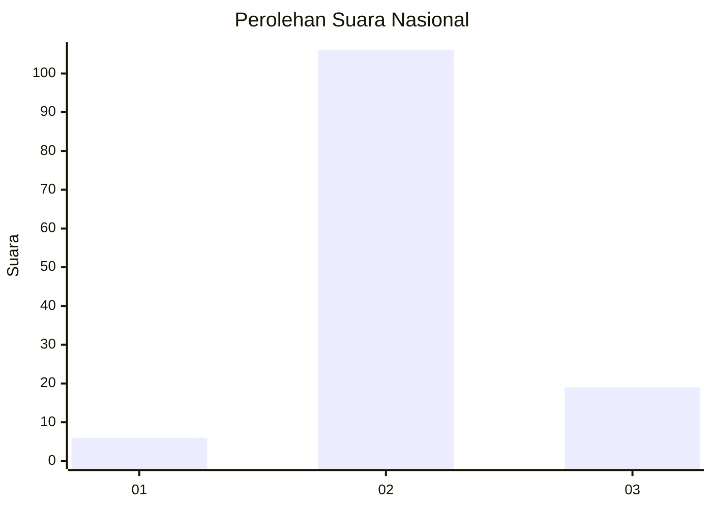
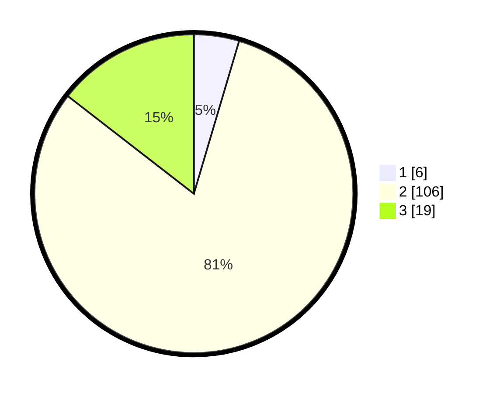

# Hasil

## Grafik

## Tabel

| No. | Nama Paslon    | Suara | Suara (raw) | Persentase |
|:--- |:-------------- | -----:| -----------:| ----------:|
| 1   | ANIES MUHAIMIN | 6     | [6][p-1]    | 4,58       |
| 2   | PRABOWO GIBRAN | 106   | [106][p-2]  | 80,92      |
| 3   | GANJAR MAHFUD  | 19    | [19][p-3]   | 14,50      |

[p-1]: https://github.com/gigit-pemilu/pemilu-2024/blob/main/pilpres/hitung-suara/sub/93-papua-selatan/sub/01-merauke/sub/08-sota/sub/2002-yanggandur/sub/002-tps/sub/paslon-1.txt
[p-2]: https://github.com/gigit-pemilu/pemilu-2024/blob/main/pilpres/hitung-suara/sub/93-papua-selatan/sub/01-merauke/sub/08-sota/sub/2002-yanggandur/sub/002-tps/sub/paslon-2.txt
[p-3]: https://github.com/gigit-pemilu/pemilu-2024/blob/main/pilpres/hitung-suara/sub/93-papua-selatan/sub/01-merauke/sub/08-sota/sub/2002-yanggandur/sub/002-tps/sub/paslon-3.txt

## Foto C Plano

https://sirekap-obj-formc.kpu.go.id/22c9/pemilu/ppwp/93/01/08/20/02/9301082002002-20240215-161555--152fab77-490c-41f6-9fa8-4dc8b75d36b1.jpg

https://sirekap-obj-formc.kpu.go.id/22c9/pemilu/ppwp/93/01/08/20/02/9301082002002-20240215-182635--e86cc6fe-f8a6-4d89-b85b-5e48e2d296c2.jpg

https://sirekap-obj-formc.kpu.go.id/22c9/pemilu/ppwp/93/01/08/20/02/9301082002002-20240215-182856--33e30f10-9df6-4704-86ff-9ff660e7c38b.jpg

## Metadata

| Key        | Value               |
| ---------- | ------------------- |
| Time Stamp | 2024-02-15 20:30:46 |

