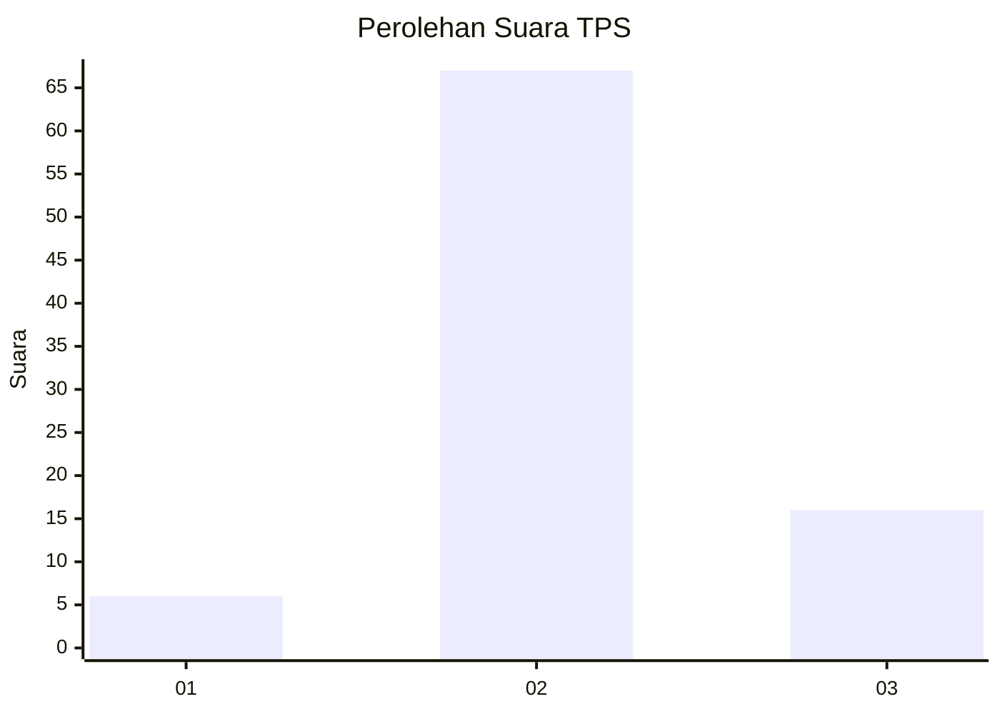
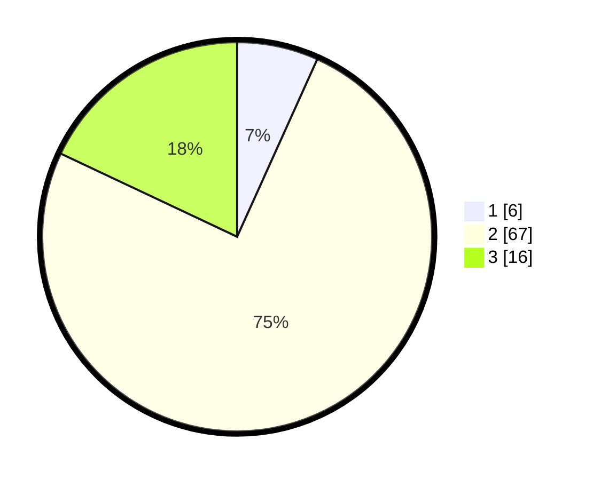

# Hasil

## Grafik

## Tabel

| No. | Nama Paslon    | Suara | Suara (raw) | Persentase |
|:--- |:-------------- | -----:| -----------:| ----------:|
| 1   | ANIES MUHAIMIN | 6     | [6][p-1]    | 6,74       |
| 2   | PRABOWO GIBRAN | 67    | [67][p-2]   | 75,28      |
| 3   | GANJAR MAHFUD  | 16    | [16][p-3]   | 17,98      |

[p-1]: https://github.com/gigit-pemilu/pemilu-2024-93-papua-selatan/blob/main/pilpres/hitung-suara/sub/93-papua-selatan/sub/01-merauke/sub/09-ulilin/sub/2001-selil/sub/004-tps/sub/paslon-1.txt
[p-2]: https://github.com/gigit-pemilu/pemilu-2024-93-papua-selatan/blob/main/pilpres/hitung-suara/sub/93-papua-selatan/sub/01-merauke/sub/09-ulilin/sub/2001-selil/sub/004-tps/sub/paslon-2.txt
[p-3]: https://github.com/gigit-pemilu/pemilu-2024-93-papua-selatan/blob/main/pilpres/hitung-suara/sub/93-papua-selatan/sub/01-merauke/sub/09-ulilin/sub/2001-selil/sub/004-tps/sub/paslon-3.txt

## Foto C Plano

https://sirekap-obj-formc.kpu.go.id/5ed4/pemilu/ppwp/93/01/09/20/01/9301092001004-20240215-021805--6b8033f6-b564-4a25-943e-366ae2427ea4.jpg

https://sirekap-obj-formc.kpu.go.id/5ed4/pemilu/ppwp/93/01/09/20/01/9301092001004-20240215-021940--b6c28de8-ceed-45ba-8356-89dc9ff4e499.jpg

https://sirekap-obj-formc.kpu.go.id/5ed4/pemilu/ppwp/93/01/09/20/01/9301092001004-20240215-022234--9bc0dbc1-c05e-4a66-8e6d-68e1e574d483.jpg

## Metadata

| Key        | Value               |
| ---------- | ------------------- |
| Time Stamp | 2024-02-25 13:00:00 |

