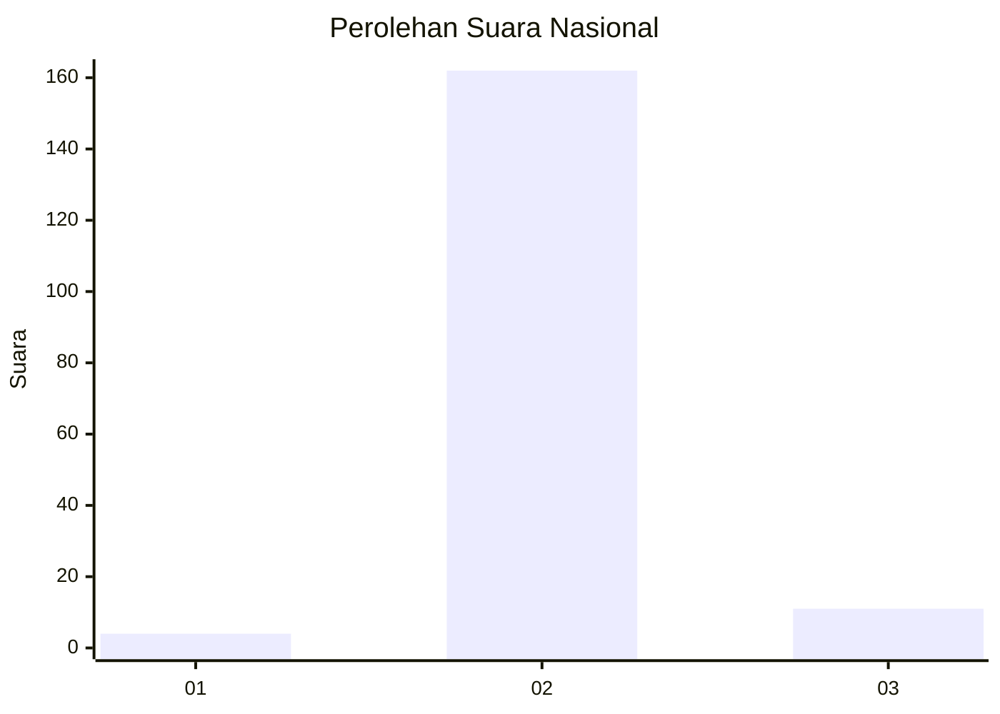
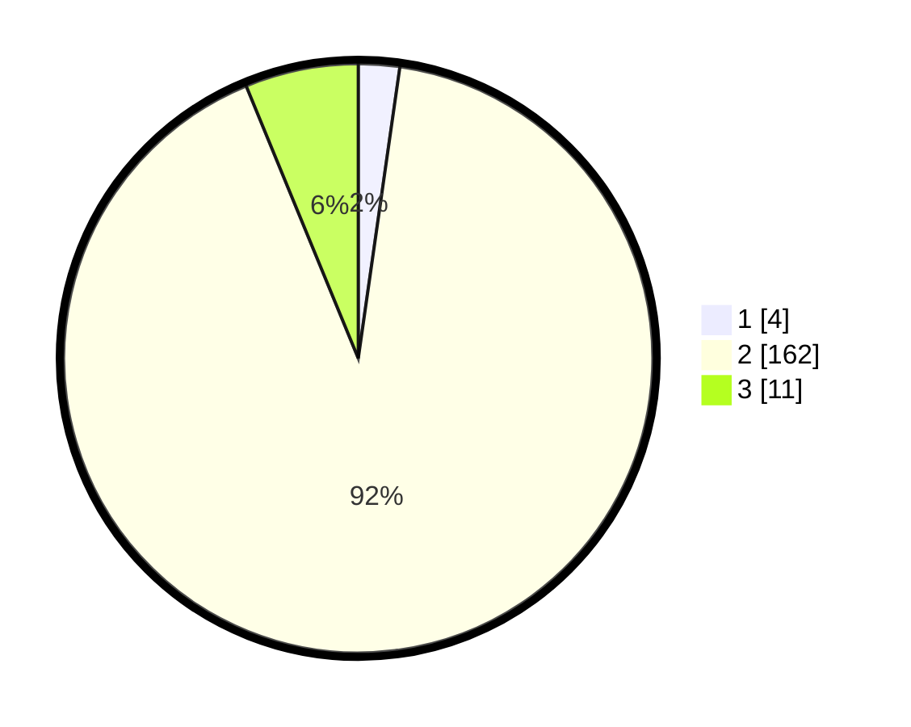

# Hasil

## Grafik

## Tabel

| No. | Nama Paslon    | Suara | Suara (raw) | Persentase |
|:--- |:-------------- | -----:| -----------:| ----------:|
| 1   | ANIES MUHAIMIN | 4     | [4][p-1]    | 2,26       |
| 2   | PRABOWO GIBRAN | 162   | [162][p-2]  | 91,53      |
| 3   | GANJAR MAHFUD  | 11    | [11][p-3]   | 6,21       |

[p-1]: https://github.com/gigit-pemilu/pemilu-2024/blob/main/pilpres/hitung-suara/sub/93-papua-selatan/sub/01-merauke/sub/11-kurik/sub/2004-sumber-rejeki/sub/001-tps/sub/paslon-1.txt
[p-2]: https://github.com/gigit-pemilu/pemilu-2024/blob/main/pilpres/hitung-suara/sub/93-papua-selatan/sub/01-merauke/sub/11-kurik/sub/2004-sumber-rejeki/sub/001-tps/sub/paslon-2.txt
[p-3]: https://github.com/gigit-pemilu/pemilu-2024/blob/main/pilpres/hitung-suara/sub/93-papua-selatan/sub/01-merauke/sub/11-kurik/sub/2004-sumber-rejeki/sub/001-tps/sub/paslon-3.txt

## Foto C Plano

https://sirekap-obj-formc.kpu.go.id/e0fd/pemilu/ppwp/93/01/11/20/04/9301112004001-20240214-133009--6b12cacc-6904-4333-b711-4a1416603f58.jpg

https://sirekap-obj-formc.kpu.go.id/e0fd/pemilu/ppwp/93/01/11/20/04/9301112004001-20240214-141453--4010a885-d2f0-48c1-9749-be2447ad915b.jpg

https://sirekap-obj-formc.kpu.go.id/e0fd/pemilu/ppwp/93/01/11/20/04/9301112004001-20240214-141302--78950301-87f0-4443-a7e2-61a2276c11fb.jpg

## Metadata

| Key        | Value               |
| ---------- | ------------------- |
| Time Stamp | 2024-02-21 22:00:00 |

