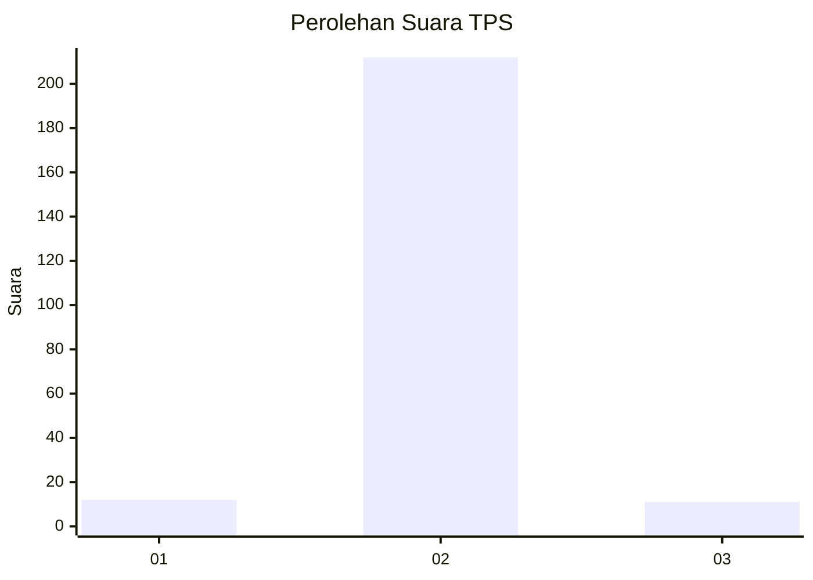
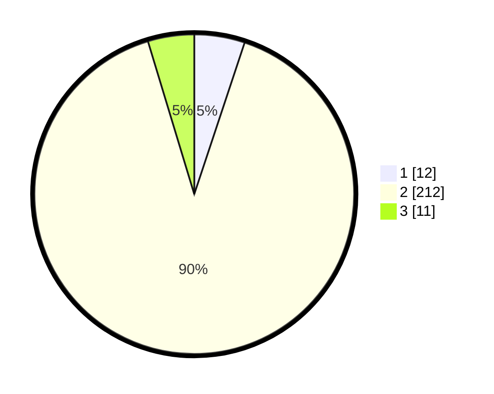

# Hasil

## Grafik

## Tabel

| No. | Nama Paslon    | Suara | Suara (raw) | Persentase |
|:--- |:-------------- | -----:| -----------:| ----------:|
| 1   | ANIES MUHAIMIN | 12    | [12][p-1]   | 5,11       |
| 2   | PRABOWO GIBRAN | 212   | [212][p-2]  | 90,21      |
| 3   | GANJAR MAHFUD  | 11    | [11][p-3]   | 4,68       |

[p-1]: https://github.com/gigit-pemilu/pemilu-2024-93-papua-selatan/blob/main/pilpres/hitung-suara/sub/93-papua-selatan/sub/01-merauke/sub/11-kurik/sub/2004-sumber-rejeki/sub/002-tps/sub/paslon-1.txt
[p-2]: https://github.com/gigit-pemilu/pemilu-2024-93-papua-selatan/blob/main/pilpres/hitung-suara/sub/93-papua-selatan/sub/01-merauke/sub/11-kurik/sub/2004-sumber-rejeki/sub/002-tps/sub/paslon-2.txt
[p-3]: https://github.com/gigit-pemilu/pemilu-2024-93-papua-selatan/blob/main/pilpres/hitung-suara/sub/93-papua-selatan/sub/01-merauke/sub/11-kurik/sub/2004-sumber-rejeki/sub/002-tps/sub/paslon-3.txt

## Foto C Plano

https://sirekap-obj-formc.kpu.go.id/5a92/pemilu/ppwp/93/01/11/20/04/9301112004002-20240215-001729--db9c8b3a-b580-45a2-a941-eadd1858a6a0.jpg

https://sirekap-obj-formc.kpu.go.id/5a92/pemilu/ppwp/93/01/11/20/04/9301112004002-20240215-001901--f36d7c0f-5c96-451a-9953-ef43311f03e6.jpg

https://sirekap-obj-formc.kpu.go.id/5a92/pemilu/ppwp/93/01/11/20/04/9301112004002-20240215-001926--43855d25-f0ee-4839-880b-85b06a32d7ec.jpg

## Metadata

| Key        | Value               |
| ---------- | ------------------- |
| Time Stamp | 2024-02-25 12:00:00 |

