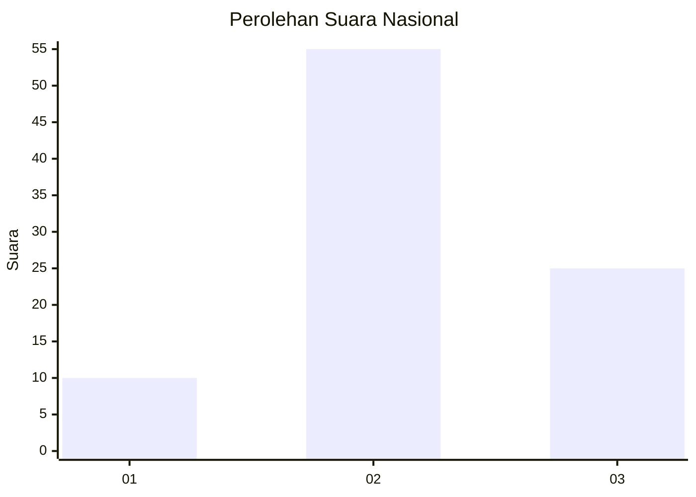
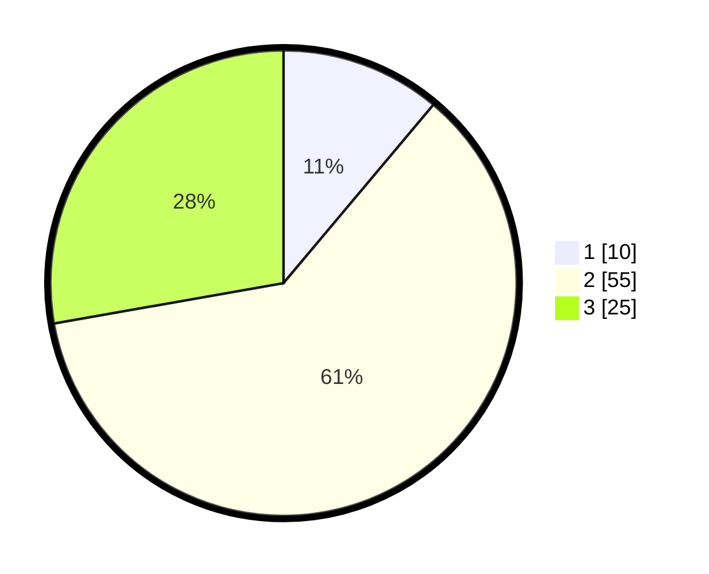

# Hasil

## Grafik

## Tabel

| No. | Nama Paslon    | Suara | Suara (raw) | Persentase |
|:--- |:-------------- | -----:| -----------:| ----------:|
| 1   | ANIES MUHAIMIN | 10    | [10][p-1]   | 11,11      |
| 2   | PRABOWO GIBRAN | 55    | [55][p-2]   | 61,11      |
| 3   | GANJAR MAHFUD  | 25    | [25][p-3]   | 27,78      |

[p-1]: https://github.com/gigit-pemilu/pemilu-2024/blob/main/pilpres/hitung-suara/sub/93-papua-selatan/sub/01-merauke/sub/12-naukenjerai/sub/2002-onggaya/sub/001-tps/sub/paslon-1.txt
[p-2]: https://github.com/gigit-pemilu/pemilu-2024/blob/main/pilpres/hitung-suara/sub/93-papua-selatan/sub/01-merauke/sub/12-naukenjerai/sub/2002-onggaya/sub/001-tps/sub/paslon-2.txt
[p-3]: https://github.com/gigit-pemilu/pemilu-2024/blob/main/pilpres/hitung-suara/sub/93-papua-selatan/sub/01-merauke/sub/12-naukenjerai/sub/2002-onggaya/sub/001-tps/sub/paslon-3.txt

## Foto C Plano

https://sirekap-obj-formc.kpu.go.id/23fe/pemilu/ppwp/93/01/12/20/02/9301122002001-20240214-222030--546375bf-aec4-4067-8d7b-27d67acb1633.jpg

https://sirekap-obj-formc.kpu.go.id/23fe/pemilu/ppwp/93/01/12/20/02/9301122002001-20240214-225043--4aa1f607-d9f6-44a9-bd05-51781e0893e5.jpg

https://sirekap-obj-formc.kpu.go.id/23fe/pemilu/ppwp/93/01/12/20/02/9301122002001-20240214-223931--d34a9b38-f83c-42e4-abbc-d6942fb4ff9c.jpg

## Metadata

| Key        | Value               |
| ---------- | ------------------- |
| Time Stamp | 2024-02-25 14:00:00 |

