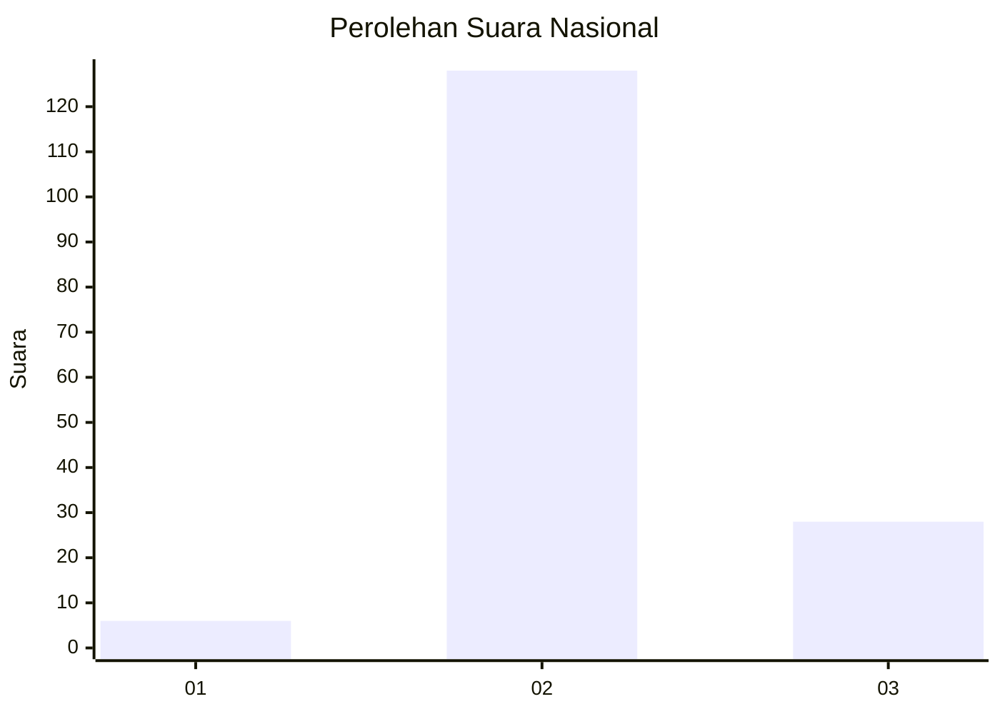

# Hasil

## Grafik

## Tabel

| No. | Nama Paslon    | Suara | Suara (raw) | Persentase |
|:--- |:-------------- | -----:| -----------:| ----------:|
| 1   | ANIES MUHAIMIN | 6     | [6][p-1]    | 3,70       |
| 2   | PRABOWO GIBRAN | 128   | [128][p-2]  | 79,01      |
| 3   | GANJAR MAHFUD  | 28    | [28][p-3]   | 17,28      |

[p-1]: https://github.com/gigit-pemilu/pemilu-2024/blob/main/pilpres/hitung-suara/sub/93-papua-selatan/sub/01-merauke/sub/14-malind/sub/2004-padang-raharja/sub/003-tps/sub/paslon-1.txt
[p-2]: https://github.com/gigit-pemilu/pemilu-2024/blob/main/pilpres/hitung-suara/sub/93-papua-selatan/sub/01-merauke/sub/14-malind/sub/2004-padang-raharja/sub/003-tps/sub/paslon-2.txt
[p-3]: https://github.com/gigit-pemilu/pemilu-2024/blob/main/pilpres/hitung-suara/sub/93-papua-selatan/sub/01-merauke/sub/14-malind/sub/2004-padang-raharja/sub/003-tps/sub/paslon-3.txt

## Foto C Plano

https://sirekap-obj-formc.kpu.go.id/d4cd/pemilu/ppwp/93/01/14/20/04/9301142004003-20240214-120722--c4d67495-9512-46af-98d8-715de2502fbc.jpg

https://sirekap-obj-formc.kpu.go.id/d4cd/pemilu/ppwp/93/01/14/20/04/9301142004003-20240214-121135--aeb5bff7-ccb3-43d4-ae2b-15645a461ba8.jpg

https://sirekap-obj-formc.kpu.go.id/d4cd/pemilu/ppwp/93/01/14/20/04/9301142004003-20240214-121335--14510ba3-20d2-4ceb-a52f-7590c2e31610.jpg

## Metadata

| Key        | Value               |
| ---------- | ------------------- |
| Time Stamp | 2024-02-24 22:31:28 |

