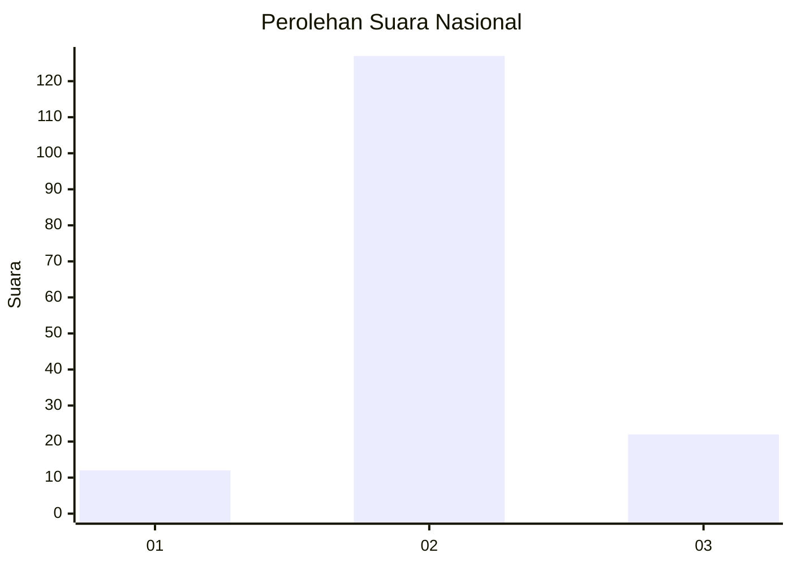
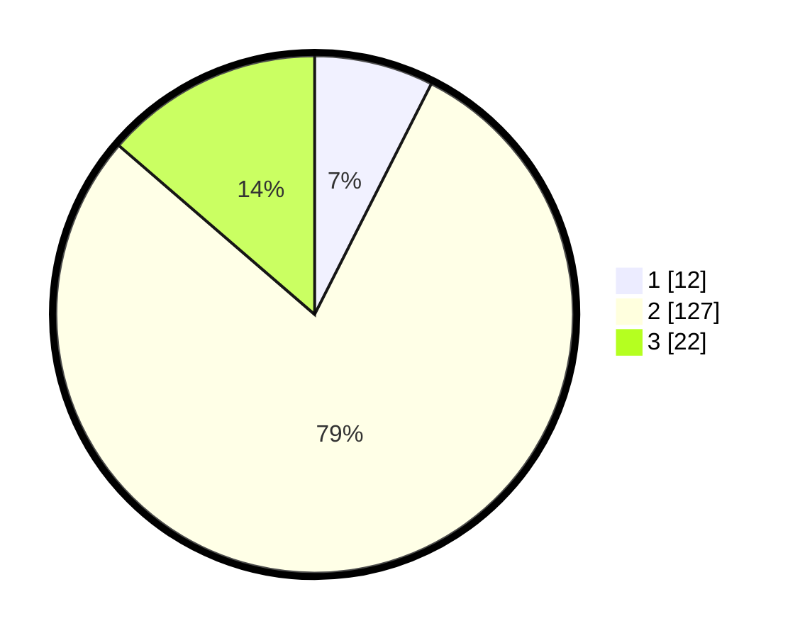

# Hasil

## Grafik

## Tabel

| No. | Nama Paslon    | Suara | Suara (raw) | Persentase |
|:--- |:-------------- | -----:| -----------:| ----------:|
| 1   | ANIES MUHAIMIN | 12    | [12][p-1]   | 7,45       |
| 2   | PRABOWO GIBRAN | 127   | [127][p-2]  | 78,88      |
| 3   | GANJAR MAHFUD  | 22    | [22][p-3]   | 13,66      |

[p-1]: https://github.com/gigit-pemilu/pemilu-2024/blob/main/pilpres/hitung-suara/sub/93-papua-selatan/sub/01-merauke/sub/14-malind/sub/2004-padang-raharja/sub/008-tps/sub/paslon-1.txt
[p-2]: https://github.com/gigit-pemilu/pemilu-2024/blob/main/pilpres/hitung-suara/sub/93-papua-selatan/sub/01-merauke/sub/14-malind/sub/2004-padang-raharja/sub/008-tps/sub/paslon-2.txt
[p-3]: https://github.com/gigit-pemilu/pemilu-2024/blob/main/pilpres/hitung-suara/sub/93-papua-selatan/sub/01-merauke/sub/14-malind/sub/2004-padang-raharja/sub/008-tps/sub/paslon-3.txt

## Foto C Plano

https://sirekap-obj-formc.kpu.go.id/8032/pemilu/ppwp/93/01/14/20/04/9301142004008-20240214-132316--d07ccca7-bc5b-48c7-ad0d-76c4b47ef663.jpg

https://sirekap-obj-formc.kpu.go.id/8032/pemilu/ppwp/93/01/14/20/04/9301142004008-20240214-132050--1fffa347-f443-4b8e-ba80-274463141bd4.jpg

https://sirekap-obj-formc.kpu.go.id/8032/pemilu/ppwp/93/01/14/20/04/9301142004008-20240214-132206--0aa57392-1dc1-4e1b-8355-f11bd39e51de.jpg

## Metadata

| Key        | Value               |
| ---------- | ------------------- |
| Time Stamp | 2024-02-25 14:00:00 |

