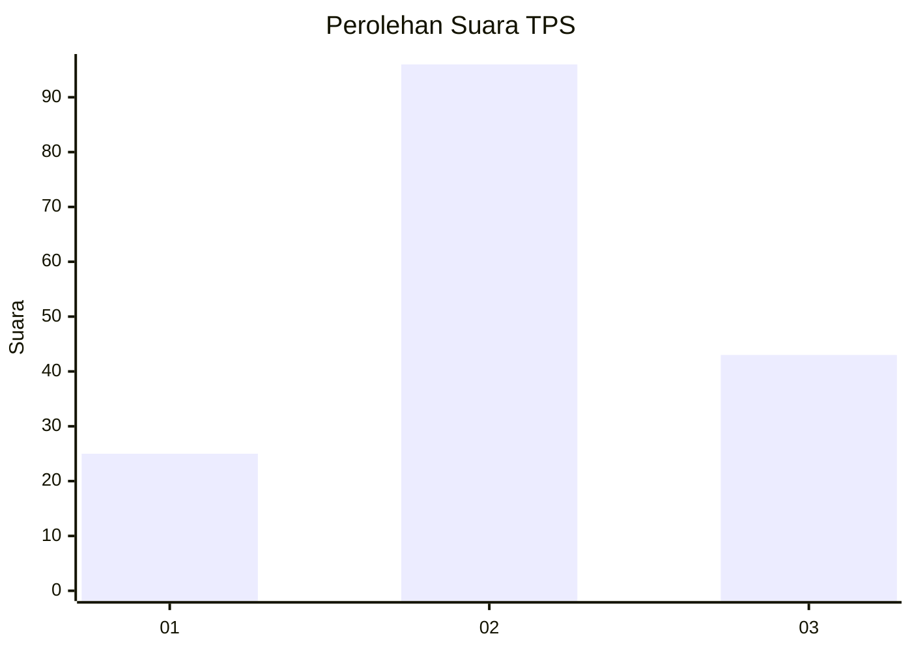
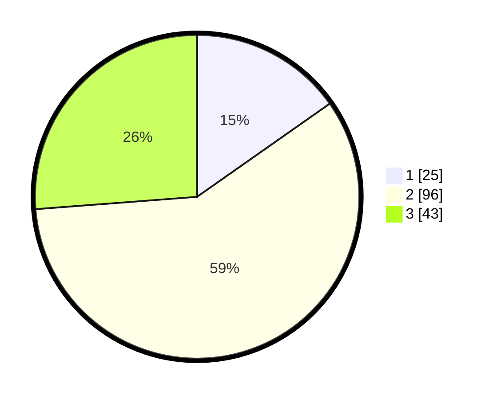

# Hasil

## Grafik

## Tabel

| No. | Nama Paslon    | Suara | Suara (raw) | Persentase |
|:--- |:-------------- | -----:| -----------:| ----------:|
| 1   | ANIES MUHAIMIN | 25    | [25][p-1]   | 15,24      |
| 2   | PRABOWO GIBRAN | 96    | [96][p-2]   | 58,54      |
| 3   | GANJAR MAHFUD  | 43    | [43][p-3]   | 26,22      |

[p-1]: https://github.com/gigit-pemilu/pemilu-2024-93-papua-selatan/blob/main/pilpres/hitung-suara/sub/93-papua-selatan/sub/02-boven-digoel/sub/01-mandobo/sub/2003-persatuan/sub/025-tps/sub/paslon-1.txt
[p-2]: https://github.com/gigit-pemilu/pemilu-2024-93-papua-selatan/blob/main/pilpres/hitung-suara/sub/93-papua-selatan/sub/02-boven-digoel/sub/01-mandobo/sub/2003-persatuan/sub/025-tps/sub/paslon-2.txt
[p-3]: https://github.com/gigit-pemilu/pemilu-2024-93-papua-selatan/blob/main/pilpres/hitung-suara/sub/93-papua-selatan/sub/02-boven-digoel/sub/01-mandobo/sub/2003-persatuan/sub/025-tps/sub/paslon-3.txt

## Foto C Plano

https://sirekap-obj-formc.kpu.go.id/17f7/pemilu/ppwp/93/02/01/20/03/9302012003025-20240215-065320--4d704582-8de6-41f8-9c58-d6371a806d6a.jpg

https://sirekap-obj-formc.kpu.go.id/17f7/pemilu/ppwp/93/02/01/20/03/9302012003025-20240215-065450--07a7da74-3891-42a9-9ae3-2d8701c43bd9.jpg

https://sirekap-obj-formc.kpu.go.id/17f7/pemilu/ppwp/93/02/01/20/03/9302012003025-20240215-065740--b63c5d53-70d2-4213-9416-eab2f54cc50a.jpg

## Metadata

| Key        | Value               |
| ---------- | ------------------- |
| Time Stamp | 2024-02-25 13:00:00 |

