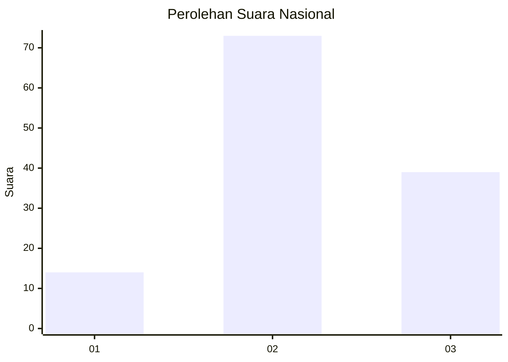
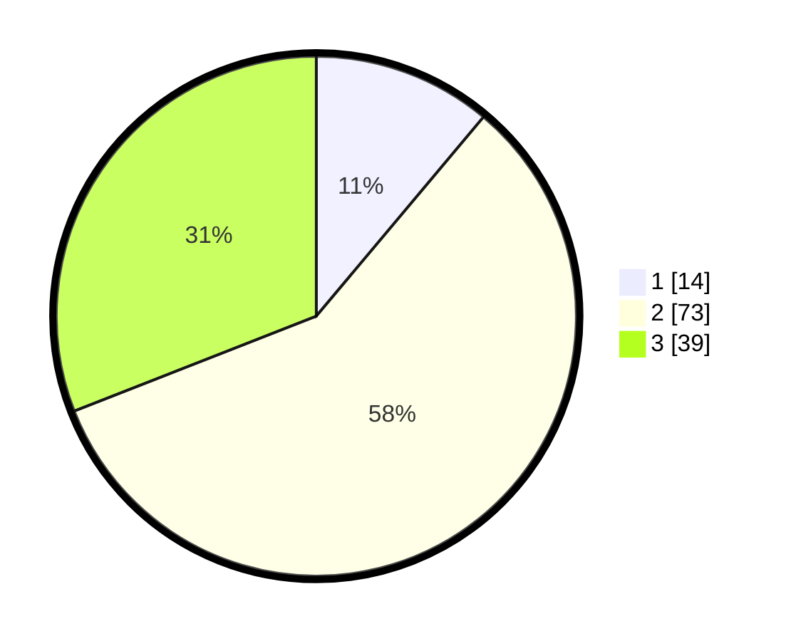

# Hasil

## Grafik

## Tabel

| No. | Nama Paslon    | Suara | Suara (raw) | Persentase |
|:--- |:-------------- | -----:| -----------:| ----------:|
| 1   | ANIES MUHAIMIN | 14    | [14][p-1]   | 11,11      |
| 2   | PRABOWO GIBRAN | 73    | [73][p-2]   | 57,94      |
| 3   | GANJAR MAHFUD  | 39    | [39][p-3]   | 30,95      |

[p-1]: https://github.com/gigit-pemilu/pemilu-2024/blob/main/pilpres/hitung-suara/sub/93-papua-selatan/sub/02-boven-digoel/sub/01-mandobo/sub/2003-persatuan/sub/027-tps/sub/paslon-1.txt
[p-2]: https://github.com/gigit-pemilu/pemilu-2024/blob/main/pilpres/hitung-suara/sub/93-papua-selatan/sub/02-boven-digoel/sub/01-mandobo/sub/2003-persatuan/sub/027-tps/sub/paslon-2.txt
[p-3]: https://github.com/gigit-pemilu/pemilu-2024/blob/main/pilpres/hitung-suara/sub/93-papua-selatan/sub/02-boven-digoel/sub/01-mandobo/sub/2003-persatuan/sub/027-tps/sub/paslon-3.txt

## Foto C Plano

https://sirekap-obj-formc.kpu.go.id/2e2d/pemilu/ppwp/93/02/01/20/03/9302012003027-20240215-050102--c04d66d2-3c0f-4915-a179-3ed54980bc01.jpg

https://sirekap-obj-formc.kpu.go.id/2e2d/pemilu/ppwp/93/02/01/20/03/9302012003027-20240215-050424--7e323c72-8527-4c95-980b-598cbbb9a617.jpg

https://sirekap-obj-formc.kpu.go.id/2e2d/pemilu/ppwp/93/02/01/20/03/9302012003027-20240215-051018--74b92de8-db1a-4a56-9d70-4ca2dc2a90b6.jpg

## Metadata

| Key        | Value               |
| ---------- | ------------------- |
| Time Stamp | 2024-02-25 13:00:00 |

