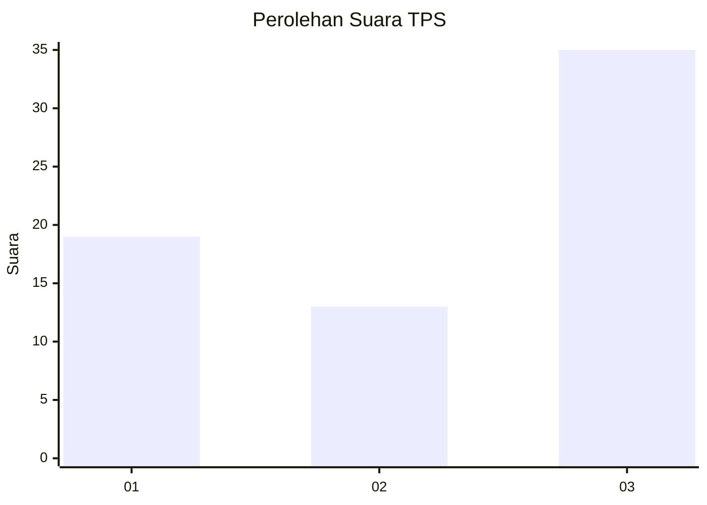
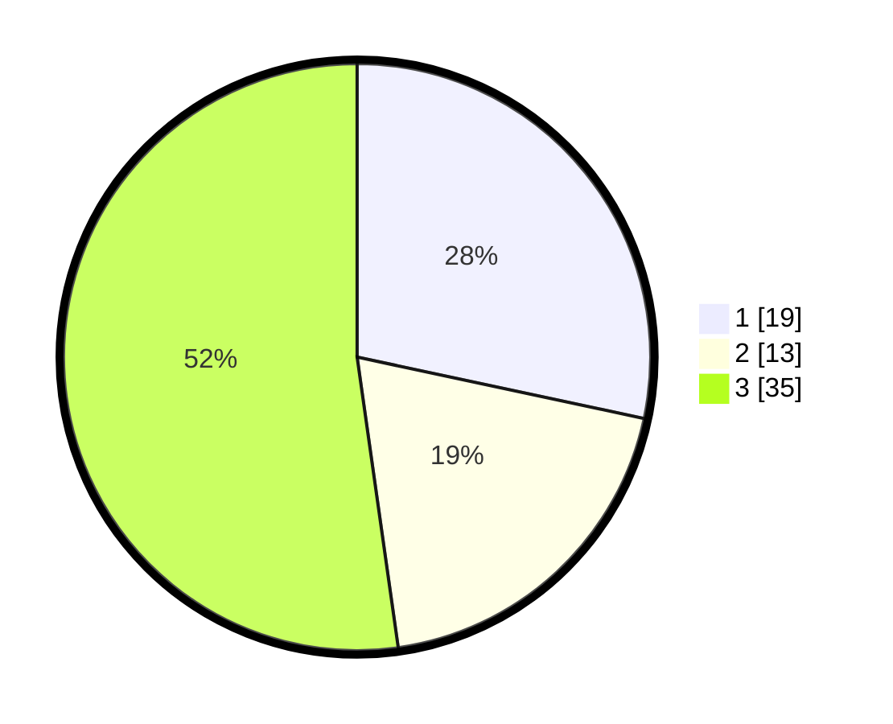

# Hasil

## Grafik

## Tabel

| No. | Nama Paslon    | Suara | Suara (raw) | Persentase |
|:--- |:-------------- | -----:| -----------:| ----------:|
| 1   | ANIES MUHAIMIN | 19    | [19][p-1]   | 28,36      |
| 2   | PRABOWO GIBRAN | 13    | [13][p-2]   | 19,40      |
| 3   | GANJAR MAHFUD  | 35    | [35][p-3]   | 52,24      |

[p-1]: https://github.com/gigit-pemilu/pemilu-2024-93-papua-selatan/blob/main/pilpres/hitung-suara/sub/93-papua-selatan/sub/02-boven-digoel/sub/03-waropko/sub/2001-woropko/sub/002-tps/sub/paslon-1.txt
[p-2]: https://github.com/gigit-pemilu/pemilu-2024-93-papua-selatan/blob/main/pilpres/hitung-suara/sub/93-papua-selatan/sub/02-boven-digoel/sub/03-waropko/sub/2001-woropko/sub/002-tps/sub/paslon-2.txt
[p-3]: https://github.com/gigit-pemilu/pemilu-2024-93-papua-selatan/blob/main/pilpres/hitung-suara/sub/93-papua-selatan/sub/02-boven-digoel/sub/03-waropko/sub/2001-woropko/sub/002-tps/sub/paslon-3.txt

## Foto C Plano

https://sirekap-obj-formc.kpu.go.id/76ea/pemilu/ppwp/93/02/03/20/01/9302032001002-20240220-210946--98595f13-597e-448c-be4b-a03facefda52.jpg

https://sirekap-obj-formc.kpu.go.id/76ea/pemilu/ppwp/93/02/03/20/01/9302032001002-20240220-211036--cafa5941-0745-4c3d-9843-afb39e8f7087.jpg

https://sirekap-obj-formc.kpu.go.id/76ea/pemilu/ppwp/93/02/03/20/01/9302032001002-20240220-211527--8bed0d32-f1f1-469c-9f09-540cc649bc39.jpg

## Metadata

| Key        | Value               |
| ---------- | ------------------- |
| Time Stamp | 2024-02-20 22:00:00 |

## DATA PEMILIH TETAP

Jumlah pemilih dalam DPT: **113**.
 * L: **59**.
 * P: **54**.

## DATA PENGGUNA HAK PILIH

Jumlah pengguna hak pilih dalam DPT: **68**.
 * L: **35**.
 * P: **33**.

Jumlah pengguna hak pilih dalam DPTb: **1**.
 * L: **1**.
 * P: **0**.

Jumlah pengguna hak pilih dalam DPK: **0**.
 * L: **0**.
 * P: **0**.

Jumlah pengguna hak pilih: **69**.
 * L: **36**.
 * P: **33**.

## JUMLAH SUARA SAH DAN TIDAK SAH

JUMLAH SELURUH SUARA SAH: **67**.

JUMLAH SUARA TIDAK SAH: **2**.

JUMLAH SELURUH SUARA SAH DAN SUARA TIDAK SAH: **69**.

