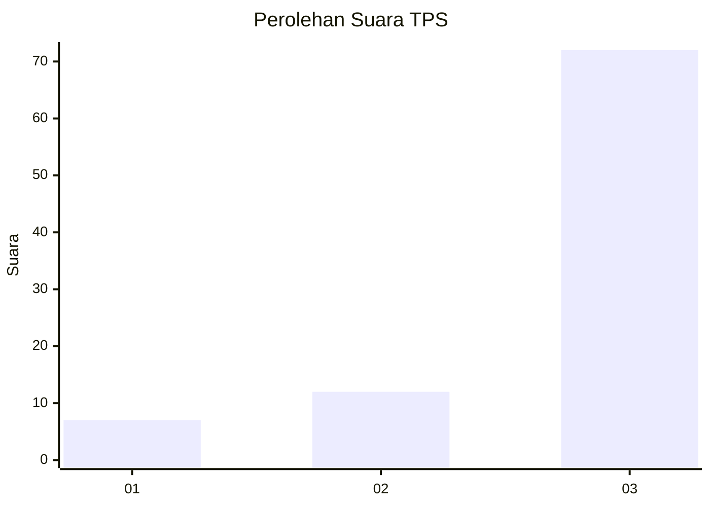
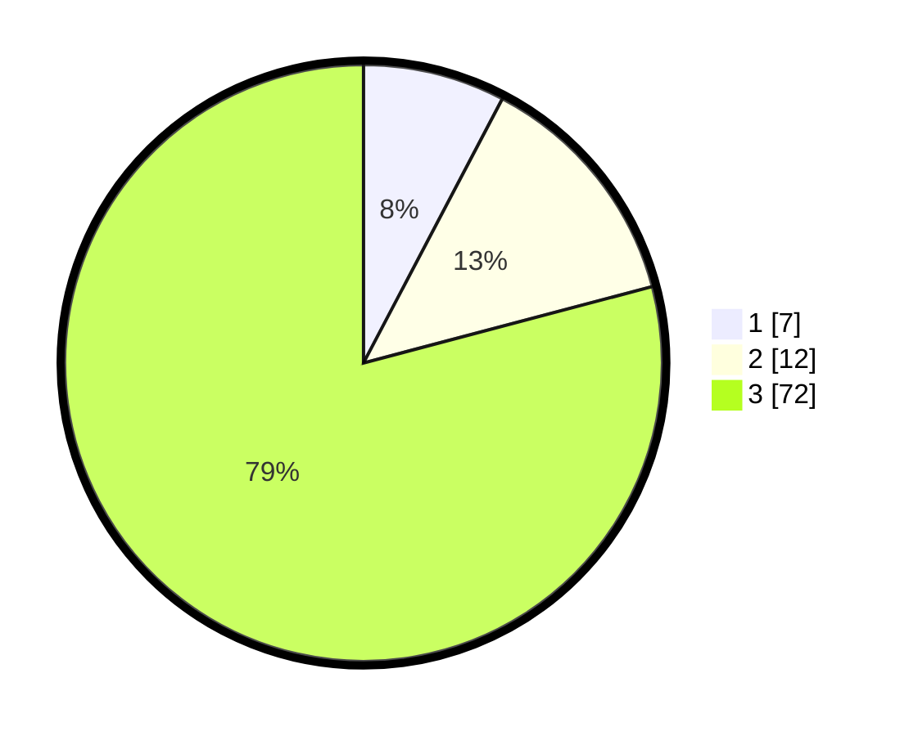

# Hasil

## Grafik

## Tabel

| No. | Nama Paslon    | Suara | Suara (raw) | Persentase |
|:--- |:-------------- | -----:| -----------:| ----------:|
| 1   | ANIES MUHAIMIN | 7     | [7][p-1]    | 7,69       |
| 2   | PRABOWO GIBRAN | 12    | [12][p-2]   | 13,19      |
| 3   | GANJAR MAHFUD  | 72    | [72][p-3]   | 79,12      |

[p-1]: https://github.com/gigit-pemilu/pemilu-2024-93-papua-selatan/blob/main/pilpres/hitung-suara/sub/93-papua-selatan/sub/02-boven-digoel/sub/15-subur/sub/2001-subur/sub/001-tps/sub/paslon-1.txt
[p-2]: https://github.com/gigit-pemilu/pemilu-2024-93-papua-selatan/blob/main/pilpres/hitung-suara/sub/93-papua-selatan/sub/02-boven-digoel/sub/15-subur/sub/2001-subur/sub/001-tps/sub/paslon-2.txt
[p-3]: https://github.com/gigit-pemilu/pemilu-2024-93-papua-selatan/blob/main/pilpres/hitung-suara/sub/93-papua-selatan/sub/02-boven-digoel/sub/15-subur/sub/2001-subur/sub/001-tps/sub/paslon-3.txt

## Foto C Plano

https://sirekap-obj-formc.kpu.go.id/85f2/pemilu/ppwp/93/02/15/20/01/9302152001001-20240216-011840--afff3c45-a712-4801-8ce2-c44668bbc6c9.jpg

https://sirekap-obj-formc.kpu.go.id/85f2/pemilu/ppwp/93/02/15/20/01/9302152001001-20240216-012044--06c92769-eb86-4a7b-ac0b-a90a730a44b3.jpg

https://sirekap-obj-formc.kpu.go.id/85f2/pemilu/ppwp/93/02/15/20/01/9302152001001-20240216-012213--16c120a5-c810-412d-a2f5-ff37efe1a0ee.jpg

## Metadata

| Key        | Value               |
| ---------- | ------------------- |
| Time Stamp | 2024-02-24 22:31:28 |

