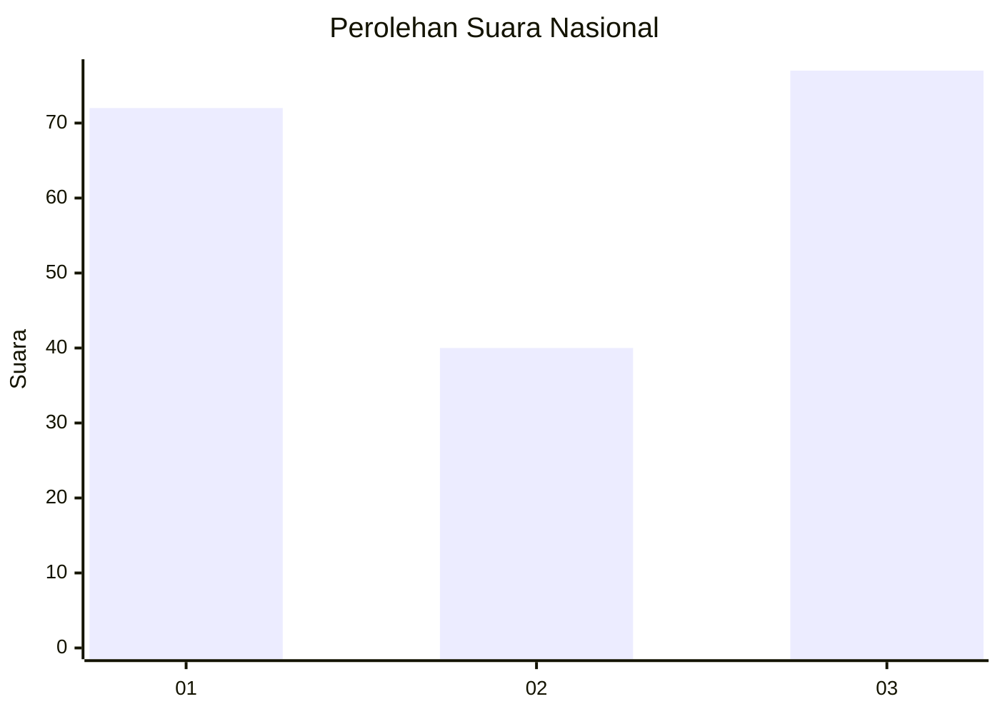
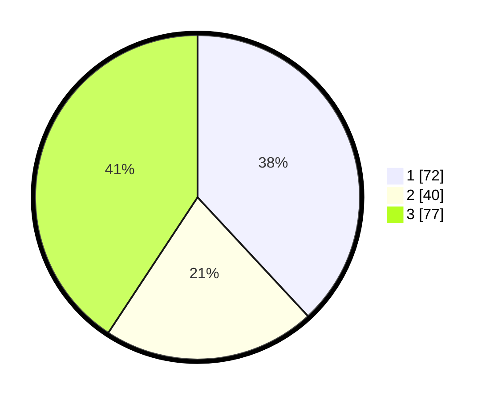

# Hasil

## Grafik

## Tabel

| No. | Nama Paslon    | Suara | Suara (raw) | Persentase |
|:--- |:-------------- | -----:| -----------:| ----------:|
| 1   | ANIES MUHAIMIN | 72    | [72][p-1]   | 38,10      |
| 2   | PRABOWO GIBRAN | 40    | [40][p-2]   | 21,16      |
| 3   | GANJAR MAHFUD  | 77    | [77][p-3]   | 40,74      |

[p-1]: https://github.com/gigit-pemilu/pemilu-2024/blob/main/pilpres/hitung-suara/sub/93-papua-selatan/sub/03-mappi/sub/05-haju/sub/2001-yagatsu/sub/001-tps/sub/paslon-1.txt
[p-2]: https://github.com/gigit-pemilu/pemilu-2024/blob/main/pilpres/hitung-suara/sub/93-papua-selatan/sub/03-mappi/sub/05-haju/sub/2001-yagatsu/sub/001-tps/sub/paslon-2.txt
[p-3]: https://github.com/gigit-pemilu/pemilu-2024/blob/main/pilpres/hitung-suara/sub/93-papua-selatan/sub/03-mappi/sub/05-haju/sub/2001-yagatsu/sub/001-tps/sub/paslon-3.txt

## Foto C Plano

https://sirekap-obj-formc.kpu.go.id/3283/pemilu/ppwp/93/03/05/20/01/9303052001001-20240217-163253--69363492-529a-4be8-8954-8a7a1825ab34.jpg

https://sirekap-obj-formc.kpu.go.id/3283/pemilu/ppwp/93/03/05/20/01/9303052001001-20240217-154644--00444e30-a16e-4d9e-a70e-f4353bf8b096.jpg

https://sirekap-obj-formc.kpu.go.id/3283/pemilu/ppwp/93/03/05/20/01/9303052001001-20240217-155022--23905f84-2036-4bb6-89e3-849356505809.jpg

## Metadata

| Key        | Value               |
| ---------- | ------------------- |
| Time Stamp | 2024-02-17 16:36:25 |

## DATA PEMILIH TETAP

Jumlah pemilih dalam DPT: **187**.
 * L: **836**.
 * P: **831**.

## DATA PENGGUNA HAK PILIH

Jumlah pengguna hak pilih dalam DPT: **127**.
 * L: **64**.
 * P: **3**.

Jumlah pengguna hak pilih dalam DPTb: **715**.
 * L: **807**.
 * P: **4**.

Jumlah pengguna hak pilih dalam DPK: **0**.
 * L: **800**.
 * P: **50**.

Jumlah pengguna hak pilih: **147**.
 * L: **71**.
 * P: **72**.

## JUMLAH SUARA SAH DAN TIDAK SAH

JUMLAH SELURUH SUARA SAH: **147**.

JUMLAH SUARA TIDAK SAH: **47**.

JUMLAH SELURUH SUARA SAH DAN SUARA TIDAK SAH: **190**.

