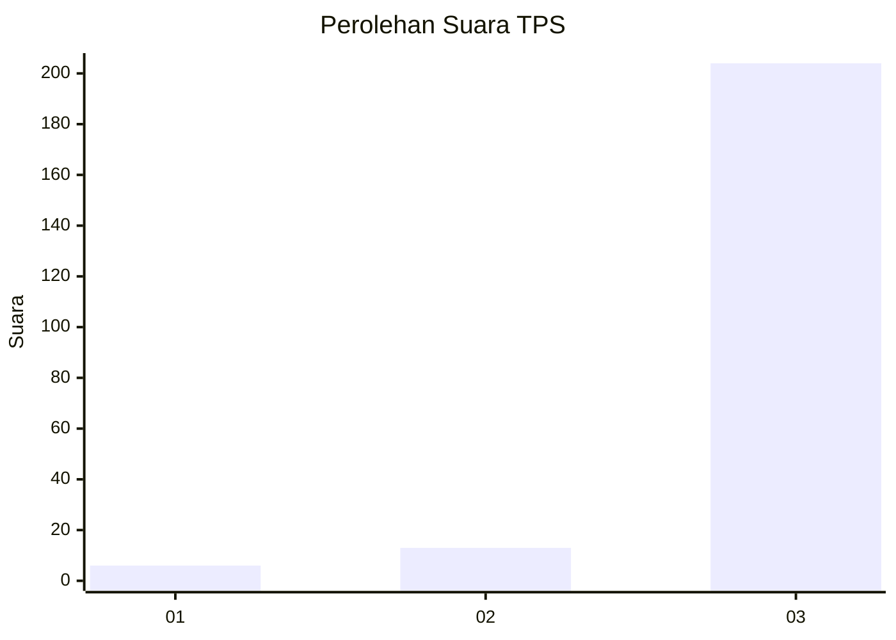
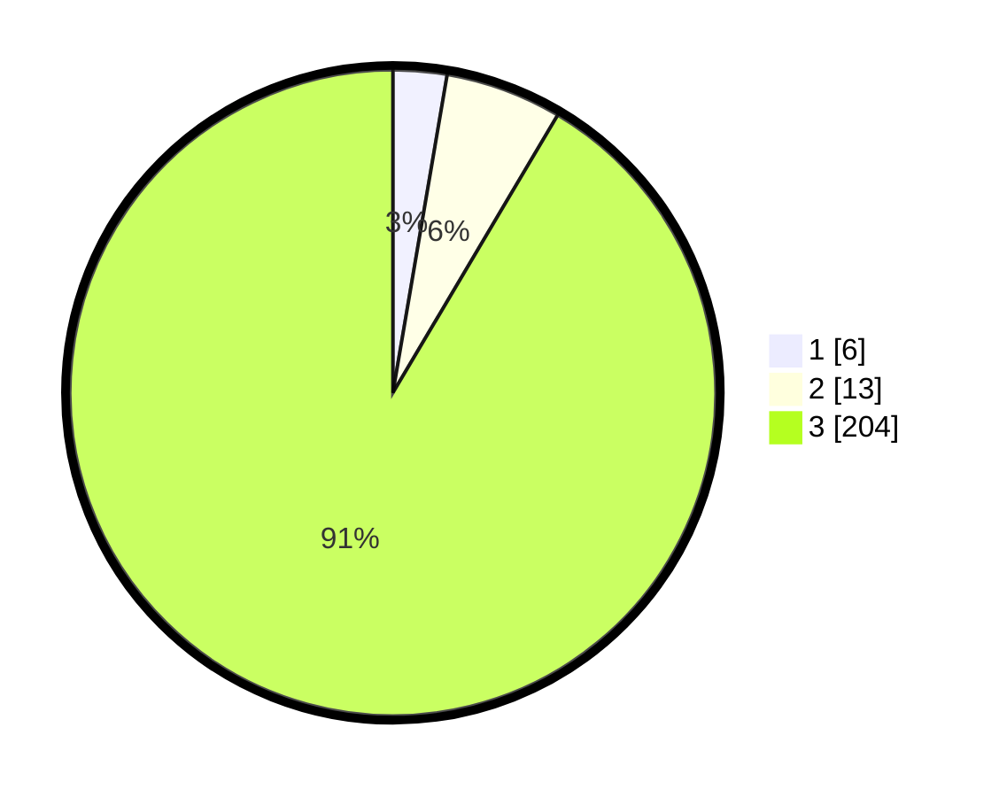

# Hasil

## Grafik

## Tabel

| No. | Nama Paslon    | Suara | Suara (raw) | Persentase |
|:--- |:-------------- | -----:| -----------:| ----------:|
| 1   | ANIES MUHAIMIN | 6     | [6][p-1]    | 2,69       |
| 2   | PRABOWO GIBRAN | 13    | [13][p-2]   | 5,83       |
| 3   | GANJAR MAHFUD  | 204   | [204][p-3]  | 91,48      |

[p-1]: https://github.com/gigit-pemilu/pemilu-2024-93-papua-selatan/blob/main/pilpres/hitung-suara/sub/93-papua-selatan/sub/03-mappi/sub/05-haju/sub/2005-wiyage/sub/002-tps/sub/paslon-1.txt
[p-2]: https://github.com/gigit-pemilu/pemilu-2024-93-papua-selatan/blob/main/pilpres/hitung-suara/sub/93-papua-selatan/sub/03-mappi/sub/05-haju/sub/2005-wiyage/sub/002-tps/sub/paslon-2.txt
[p-3]: https://github.com/gigit-pemilu/pemilu-2024-93-papua-selatan/blob/main/pilpres/hitung-suara/sub/93-papua-selatan/sub/03-mappi/sub/05-haju/sub/2005-wiyage/sub/002-tps/sub/paslon-3.txt

## Foto C Plano

https://sirekap-obj-formc.kpu.go.id/8ffb/pemilu/ppwp/93/03/05/20/05/9303052005002-20240217-112419--47d176db-16cf-4fc2-84d3-ff28973e129a.jpg

https://sirekap-obj-formc.kpu.go.id/8ffb/pemilu/ppwp/93/03/05/20/05/9303052005002-20240217-112648--6b1845cc-90de-43ee-b150-a87eaffa5096.jpg

https://sirekap-obj-formc.kpu.go.id/8ffb/pemilu/ppwp/93/03/05/20/05/9303052005002-20240217-112840--761112ea-267b-45ca-a5ab-562d6d928455.jpg

## Metadata

| Key        | Value               |
| ---------- | ------------------- |
| Time Stamp | 2024-02-25 13:00:00 |

