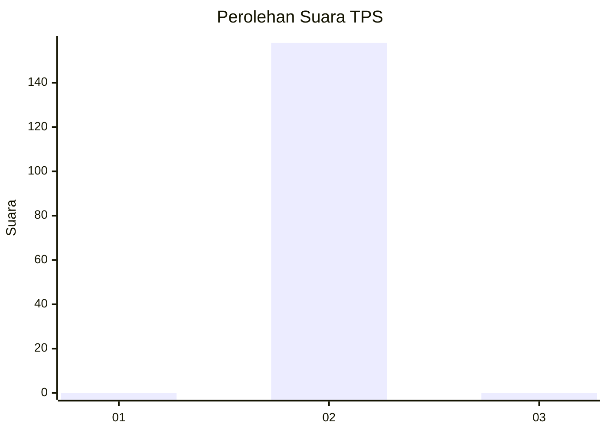
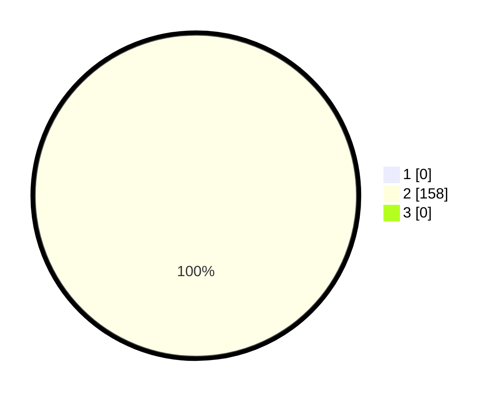

# Hasil

## Grafik

## Tabel

| No. | Nama Paslon    | Suara | Suara (raw) | Persentase |
|:--- |:-------------- | -----:| -----------:| ----------:|
| 1   | ANIES MUHAIMIN | 0     | [0][p-1]    | 0,00       |
| 2   | PRABOWO GIBRAN | 158   | [158][p-2]  | 100,00     |
| 3   | GANJAR MAHFUD  | 0     | [0][p-3]    | 0,00       |

[p-1]: https://github.com/gigit-pemilu/pemilu-2024-93-papua-selatan/blob/main/pilpres/hitung-suara/sub/93-papua-selatan/sub/03-mappi/sub/08-passue/sub/2002-bagaram/sub/001-tps/sub/paslon-1.txt
[p-2]: https://github.com/gigit-pemilu/pemilu-2024-93-papua-selatan/blob/main/pilpres/hitung-suara/sub/93-papua-selatan/sub/03-mappi/sub/08-passue/sub/2002-bagaram/sub/001-tps/sub/paslon-2.txt
[p-3]: https://github.com/gigit-pemilu/pemilu-2024-93-papua-selatan/blob/main/pilpres/hitung-suara/sub/93-papua-selatan/sub/03-mappi/sub/08-passue/sub/2002-bagaram/sub/001-tps/sub/paslon-3.txt

## Foto C Plano

https://sirekap-obj-formc.kpu.go.id/491b/pemilu/ppwp/93/03/08/20/02/9303082002001-20240217-083508--9949b44d-4111-443a-b530-cb1e86e91a63.jpg

https://sirekap-obj-formc.kpu.go.id/491b/pemilu/ppwp/93/03/08/20/02/9303082002001-20240217-083702--a4e57bfa-8495-4961-a13b-264c96bd42bf.jpg

https://sirekap-obj-formc.kpu.go.id/491b/pemilu/ppwp/93/03/08/20/02/9303082002001-20240217-083744--52b59770-6335-4d0f-80bc-94b7ec5276c8.jpg

## Metadata

| Key        | Value               |
| ---------- | ------------------- |
| Time Stamp | 2024-02-25 12:00:00 |

