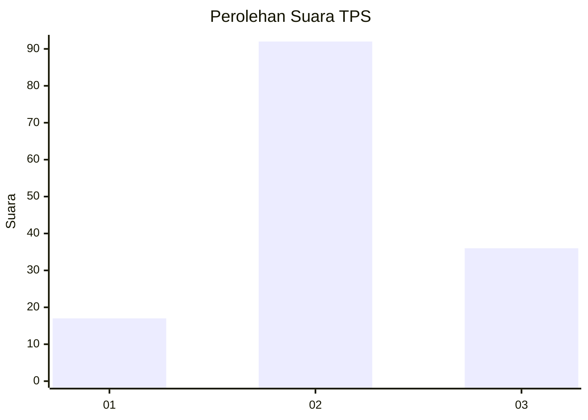
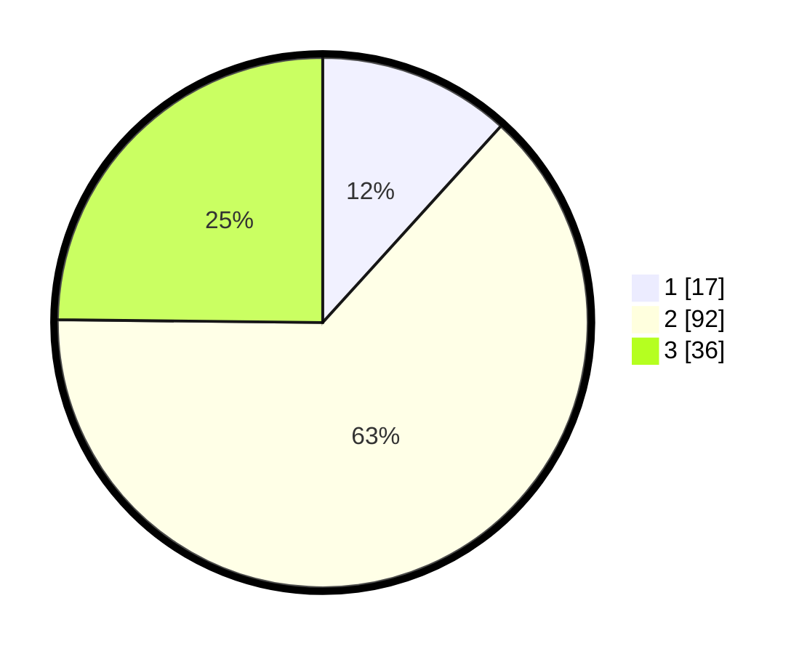

# Hasil

## Grafik

## Tabel

| No. | Nama Paslon    | Suara | Suara (raw) | Persentase |
|:--- |:-------------- | -----:| -----------:| ----------:|
| 1   | ANIES MUHAIMIN | 17    | [17][p-1]   | 11,72      |
| 2   | PRABOWO GIBRAN | 92    | [92][p-2]   | 63,45      |
| 3   | GANJAR MAHFUD  | 36    | [36][p-3]   | 24,83      |

[p-1]: https://github.com/gigit-pemilu/pemilu-2024-93-papua-selatan/blob/main/pilpres/hitung-suara/sub/93-papua-selatan/sub/04-asmat/sub/01-agats/sub/2005-bis-agats/sub/009-tps/sub/paslon-1.txt
[p-2]: https://github.com/gigit-pemilu/pemilu-2024-93-papua-selatan/blob/main/pilpres/hitung-suara/sub/93-papua-selatan/sub/04-asmat/sub/01-agats/sub/2005-bis-agats/sub/009-tps/sub/paslon-2.txt
[p-3]: https://github.com/gigit-pemilu/pemilu-2024-93-papua-selatan/blob/main/pilpres/hitung-suara/sub/93-papua-selatan/sub/04-asmat/sub/01-agats/sub/2005-bis-agats/sub/009-tps/sub/paslon-3.txt

## Foto C Plano

https://sirekap-obj-formc.kpu.go.id/3439/pemilu/ppwp/93/04/01/20/05/9304012005009-20240215-110325--7e9867b6-eb56-4f09-af4a-13505825ddbd.jpg

https://sirekap-obj-formc.kpu.go.id/3439/pemilu/ppwp/93/04/01/20/05/9304012005009-20240215-110454--7b22885d-070d-42fc-9026-7dc41a83fb49.jpg

https://sirekap-obj-formc.kpu.go.id/3439/pemilu/ppwp/93/04/01/20/05/9304012005009-20240215-153204--4d7ae2a0-92e4-4876-879f-124a20a1e90d.jpg

## Metadata

| Key        | Value               |
| ---------- | ------------------- |
| Time Stamp | 2024-02-25 13:00:00 |

