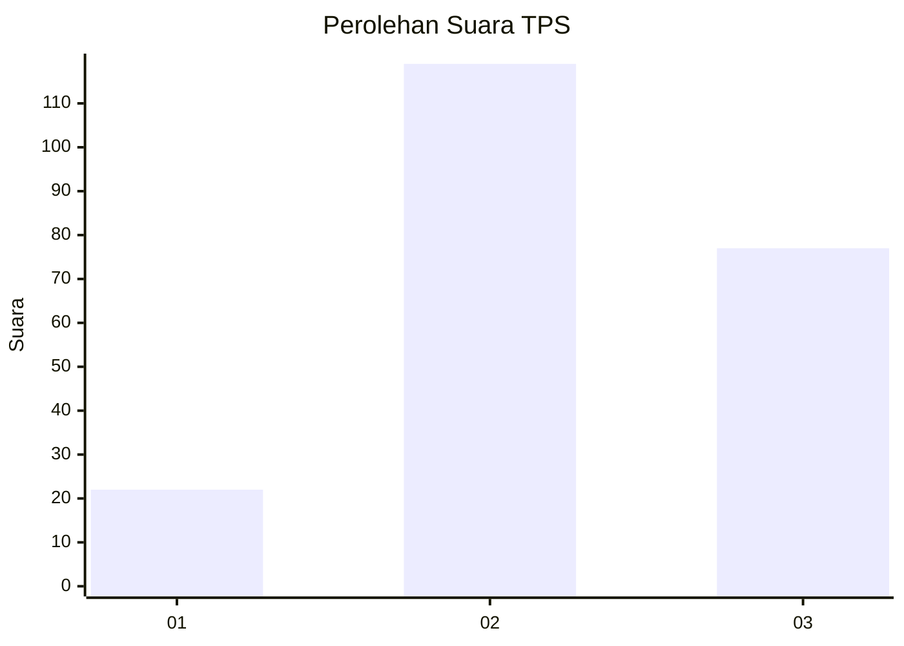
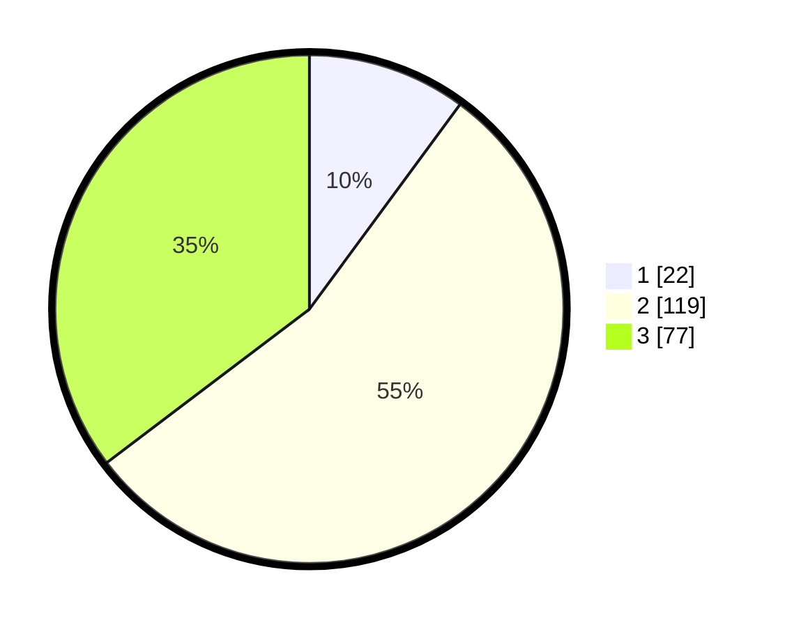

# Hasil

## Grafik

## Tabel

| No. | Nama Paslon    | Suara | Suara (raw) | Persentase |
|:--- |:-------------- | -----:| -----------:| ----------:|
| 1   | ANIES MUHAIMIN | 22    | [22][p-1]   | 10,09      |
| 2   | PRABOWO GIBRAN | 119   | [119][p-2]  | 54,59      |
| 3   | GANJAR MAHFUD  | 77    | [77][p-3]   | 35,32      |

[p-1]: https://github.com/gigit-pemilu/pemilu-2024-93-papua-selatan/blob/main/pilpres/hitung-suara/sub/93-papua-selatan/sub/04-asmat/sub/01-agats/sub/2005-bis-agats/sub/028-tps/sub/paslon-1.txt
[p-2]: https://github.com/gigit-pemilu/pemilu-2024-93-papua-selatan/blob/main/pilpres/hitung-suara/sub/93-papua-selatan/sub/04-asmat/sub/01-agats/sub/2005-bis-agats/sub/028-tps/sub/paslon-2.txt
[p-3]: https://github.com/gigit-pemilu/pemilu-2024-93-papua-selatan/blob/main/pilpres/hitung-suara/sub/93-papua-selatan/sub/04-asmat/sub/01-agats/sub/2005-bis-agats/sub/028-tps/sub/paslon-3.txt

## Foto C Plano

https://sirekap-obj-formc.kpu.go.id/da44/pemilu/ppwp/93/04/01/20/05/9304012005028-20240215-113806--b131c743-c158-4254-b53b-1d5b20fe702b.jpg

https://sirekap-obj-formc.kpu.go.id/da44/pemilu/ppwp/93/04/01/20/05/9304012005028-20240215-111036--9e1ab23b-07a8-4b69-ae75-5260e8a6b7e6.jpg

https://sirekap-obj-formc.kpu.go.id/da44/pemilu/ppwp/93/04/01/20/05/9304012005028-20240215-111318--135c597b-3db9-4312-86de-2a869ff6ea9c.jpg

## Metadata

| Key        | Value               |
| ---------- | ------------------- |
| Time Stamp | 2024-02-24 22:31:28 |

