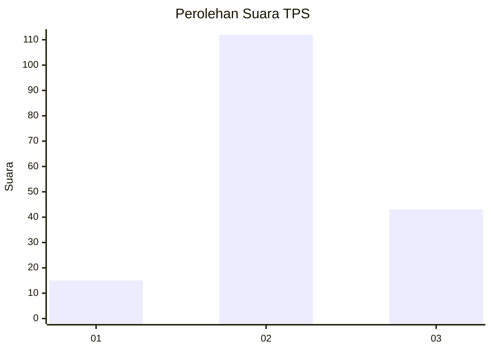
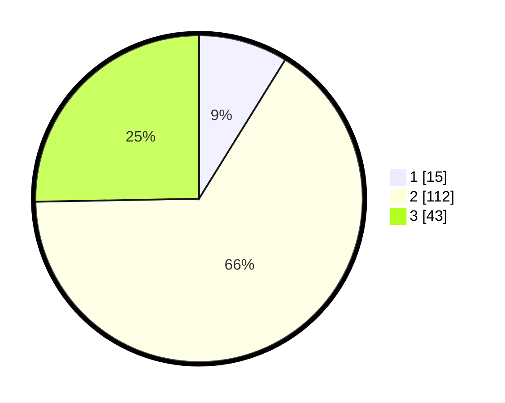

# Hasil

## Grafik

## Tabel

| No. | Nama Paslon    | Suara | Suara (raw) | Persentase |
|:--- |:-------------- | -----:| -----------:| ----------:|
| 1   | ANIES MUHAIMIN | 15    | [15][p-1]   | 8,82       |
| 2   | PRABOWO GIBRAN | 112   | [112][p-2]  | 65,88      |
| 3   | GANJAR MAHFUD  | 43    | [43][p-3]   | 25,29      |

[p-1]: https://github.com/gigit-pemilu/pemilu-2024-93-papua-selatan/blob/main/pilpres/hitung-suara/sub/93-papua-selatan/sub/04-asmat/sub/01-agats/sub/2005-bis-agats/sub/030-tps/sub/paslon-1.txt
[p-2]: https://github.com/gigit-pemilu/pemilu-2024-93-papua-selatan/blob/main/pilpres/hitung-suara/sub/93-papua-selatan/sub/04-asmat/sub/01-agats/sub/2005-bis-agats/sub/030-tps/sub/paslon-2.txt
[p-3]: https://github.com/gigit-pemilu/pemilu-2024-93-papua-selatan/blob/main/pilpres/hitung-suara/sub/93-papua-selatan/sub/04-asmat/sub/01-agats/sub/2005-bis-agats/sub/030-tps/sub/paslon-3.txt

## Foto C Plano

https://sirekap-obj-formc.kpu.go.id/acfe/pemilu/ppwp/93/04/01/20/05/9304012005030-20240215-091555--2c56b3ab-39ae-4e14-a76a-adb10d05d9bf.jpg

https://sirekap-obj-formc.kpu.go.id/acfe/pemilu/ppwp/93/04/01/20/05/9304012005030-20240215-091805--e6abd5db-e65f-493b-8830-48ce8b3cb116.jpg

https://sirekap-obj-formc.kpu.go.id/acfe/pemilu/ppwp/93/04/01/20/05/9304012005030-20240215-091941--c68c3ac1-cc5c-44b9-9700-f2e4cce83ab7.jpg

## Metadata

| Key        | Value               |
| ---------- | ------------------- |
| Time Stamp | 2024-02-25 13:00:00 |

